# Target Architecture Overview & Boundary Specification

- **Status:** Approved (Wave 0 / Task ARC-001)
- **Author:** System Architect
- **Target Audience:** Engineering, AI Agents, Code Reviewers
- **Related Audits & Plans:** [Constitution Compliance Audit.md](../../Constitution%20Compliance%20Audit.md), [Master Refactoring Plan.md](../../Master%20Refactoring%20Plan.md), [Engineering Backlog.md](../../Engineering%20Backlog.md)

---

## 1. Executive Summary & Purpose

This document establishes the canonical target architecture and system boundary specification for the Amr Systems Portfolio codebase. It serves as the governing architectural blueprint to resolve all compliance defects identified in [Constitution Compliance Audit.md](../../Constitution%20Compliance%20Audit.md), specifically establishing single-source-of-truth boundaries across content management ([CC-12](../../Constitution%20Compliance%20Audit.md#cc-12--architecture-contains-unproven-parallel-content-pipelines)), lead capture contact flows ([CC-14](../../Constitution%20Compliance%20Audit.md#cc-14--documentation-and-implementation-disagree-on-contact-ux)), configuration management, visual tokenization, identity assets, and API routes.

---

## 2. Master Architecture Decisions (AD-01 – AD-07)

The architecture is founded upon seven non-negotiable Architecture Decisions approved in the [Master Refactoring Plan.md](../../Master%20Refactoring%20Plan.md):

| Decision ID | Decision Summary | Affected Audit Items | Architectural Role |
|---|---|---|---|
| **AD-01** | `src/content` remains the canonical editorial-content source. | [CC-07](../../Constitution%20Compliance%20Audit.md#cc-07--ui-translations-are-hardcoded-and-fragmented), [CC-12](../../Constitution%20Compliance%20Audit.md#cc-12--architecture-contains-unproven-parallel-content-pipelines) | Single source for markdown collections (blog, projects, services) backed by Astro Content Collections & Decap CMS. |
| **AD-02** | A typed application locale catalog owns interface copy; content collections own editorial copy only. | [CC-07](../../Constitution%20Compliance%20Audit.md#cc-07--ui-translations-are-hardcoded-and-fragmented) | Dedicated locale catalogs (`src/i18n/` or `src/lib/locales/`) provide strongly-typed dictionaries for UI chrome. |
| **AD-03** | One typed site/runtime configuration owns contacts, social URLs, domains, origins, limits, and external endpoints. | [CC-08](../../Constitution%20Compliance%20Audit.md#cc-08--productcontact-configuration-is-scattered), [CC-13](../../Constitution%20Compliance%20Audit.md#cc-13--environment-endpoint-and-security-configuration-is-duplicated) | Prevents scattered string/number literals across components and server handlers by enforcing a validated config module. |
| **AD-04** | One semantic design-token layer is the only UI styling vocabulary. | [CC-01](../../Constitution%20Compliance%20Audit.md#cc-01--design-tokens-are-not-the-single-visual-authority), [CC-02](../../Constitution%20Compliance%20Audit.md#cc-02--forbidden-decorative-gradients-grids-and-glow-are-rendered), [CC-04](../../Constitution%20Compliance%20Audit.md#cc-04--unapproved-typefaces-and-direct-typography-declarations), [CC-05](../../Constitution%20Compliance%20Audit.md#cc-05--raw-colours-pure-white-arbitrary-radii-and-shadows-bypass-the-system) | Exposes [DESIGN.md](../../DESIGN.md) colors, typography scale, radii, and elevation exclusively through CSS/Tailwind tokens. |
| **AD-05** | `BrandMark` and the icon registry own visual identity; favicon is a generated derivative. | [CC-03](../../Constitution%20Compliance%20Audit.md#cc-03--identity-is-duplicated-no-logo-registry-exists), [CC-06](../../Constitution%20Compliance%20Audit.md#cc-06--built-in-emoji-are-used-as-ui-icons) | Replaces inline duplicated SVG logo markup and raw UI emojis with centralized SVG component registries. |
| **AD-06** | Versioned API routes are thin adapters over shared handlers/contracts. | [CC-11](../../Constitution%20Compliance%20Audit.md#cc-11--duplicate-api-contract-and-cors-logic), [CC-13](../../Constitution%20Compliance%20Audit.md#cc-13--environment-endpoint-and-security-configuration-is-duplicated) | Eliminates parallel endpoint code between `/api/*` and `/api/v1/*` by reusing canonical controllers and CORS/security helpers. |
| **AD-07** | Existing lead capture remains a direct WhatsApp conversion flow; PRODUCT.md must describe it precisely. | [CC-14](../../Constitution%20Compliance%20Audit.md#cc-14--documentation-and-implementation-disagree-on-contact-ux) | Retains the modal/navigation WhatsApp lead form and service action handler while scheduling documentation alignment in task GOV-001. |

---

## 3. High-Level Architectural Boundary Diagram

The following Mermaid diagram illustrates the strict layer boundaries, canonical sources of truth, thin API adapters, and presentation components.

```mermaid
graph TD
    subgraph Client_Layer ["Client & Page Layer"]
        P1["Astro Pages (src/pages/*)"]
        UI["Shared UI Components (src/components/ui/*)"]
    end

    subgraph Authority_Boundaries ["Single Source of Truth Boundaries"]
        subgraph Content_Boundary ["Content Boundary (AD-01, AD-02, CC-12)"]
            EC["Canonical Editorial Content (src/content/*)"]
            LC["Typed UI Locale Catalog (src/lib/locales/*)"]
            CF["Canonical Content Façade (src/lib/content/facade.ts)"]
        end

        subgraph Config_Boundary ["Config & Policy Boundary (AD-03, CC-08, CC-13)"]
            RC["Site/Runtime Config (src/lib/config/site.config.ts)"]
            SP["Security & CORS Policy Builder (src/lib/security/policy.ts)"]
        end

        subgraph Identity_Boundary ["Visual & Identity Boundary (AD-04, AD-05, CC-01..06)"]
            DT["Semantic Design Tokens (src/styles/tokens.css)"]
            BM["BrandMark Registry (src/components/brand/BrandMark.astro)"]
            IR["Icon Registry (src/components/ui/Icon.astro)"]
            FG["Favicon Generator (scripts/generate-favicons.mjs)"]
        end

        subgraph Action_Boundary ["Contact & Action Boundary (AD-07, CC-14)"]
            WA["WhatsApp Lead Capture Service (src/lib/services/whatsapp.ts)"]
        end
    end

    subgraph API_Adapters ["API Layer (AD-06, CC-11)"]
        H_PROJ["Canonical Projects Controller (src/lib/api/projects.controller.ts)"]
        H_HLTH["Canonical Health Controller (src/lib/api/health.controller.ts)"]
        R_V0["Legacy Adapter (/api/projects.ts)"]
        R_V1["Versioned Adapter (/api/v1/projects.ts)"]
        R_H0["Legacy Health (/api/health.ts)"]
        R_H1["Versioned Health (/api/v1/health.ts)"]
    end

    %% Content flows
    EC -->|Astro Collections| CF
    LC -->|Typed Chrome Copy| UI
    LC -->|Typed Chrome Copy| P1
    CF -->|Read Façade API| P1

    %% Config flows
    RC -->|Contacts, Socials, Origins| UI
    RC -->|Base Config| SP
    SP -->|CORS Headers| H_PROJ
    SP -->|CORS Headers| H_HLTH

    %% Design & Identity flows
    DT -->|CSS Vars & Utilities| UI
    DT -->|CSS Vars & Utilities| P1
    BM -->|Canonical Monogram| UI
    BM -.->|Source Vectors| FG
    IR -->|Registered Icons| UI

    %% Contact flows
    RC -->|Phone Number & Direct Links| WA
    UI -->|Lead Details| WA

    %% API flows
    R_V0 -->|Thin Routing Adapter| H_PROJ
    R_V1 -->|Thin Routing Adapter| H_PROJ
    R_H0 -->|Thin Routing Adapter| H_HLTH
    R_H1 -->|Thin Routing Adapter| H_HLTH
```

---

## 4. Key Architectural Boundary Definitions

### 4.1 Content Access Boundary (Resolving CC-12)
- **Canonical Source:** Markdown files in `src/content/` managed via Astro Content Collections and Decap CMS.
- **Access Pattern:** All page templates MUST query content through the canonical façade (`src/lib/content/facade.ts` implemented in task `CNT-001`). Direct usage of raw un-governed data pipelines or legacy `contentHubClient.ts` SDKs is prohibited without explicit architectural encapsulation.
- **Detailed Reference:** See [001-content-boundary.md](001-content-boundary.md).

### 4.2 UI Copy vs. Editorial Content Boundary (Resolving CC-07)
- **Editorial Copy:** CMS-authored markdown fields (e.g., project titles, case study summaries, blog body text) reside in `src/content/`.
- **UI Copy:** Navigation labels, footer links, form field instructions, CTA button texts, and error messages reside in a typed locale catalog (`src/lib/locales/` or `src/i18n/`). Raw hardcoded strings or local ternary string maps in `.astro` files are strictly forbidden.

### 4.3 Configuration & Secrets Boundary (Resolving CC-08, CC-13)
- **Single Source:** `src/lib/config/site.config.ts` owns domain names, CORS allowed origins, WhatsApp target phone numbers (`201017749925`), social media links, timeout durations, and rate limits.
- **Security Isolation:** Server-side environment variables (`.env`) and client-exposed public config items are segregated through typed schemas (`siteConfig.public` vs `siteConfig.server`).

### 4.4 Visual Vocabulary & Identity Boundary (Resolving CC-01 – CC-06)
- **Visual Vocabulary:** Styling is restricted to semantic design tokens (`--color-primary`, `--color-bg-neutral`, `--color-card-bg`, `--font-display`, `--font-body`, etc.) defined in `src/styles/tokens.css` and mapped to Tailwind tokens. Direct raw hex values (`#38BDF8`), pure white (`#ffffff`), and unapproved fonts (`Cinzel`, `Playfair Display`) are rejected.
- **Identity Assets:** All brand logomarks MUST be rendered via `BrandMark.astro`. Favicons are derived build artifacts generated directly from the canonical SVG monogram source. Emojis in UI elements are replaced by SVG entries in `Icon.astro`.
- **Detailed Reference:** See [002-configuration-and-identity.md](002-configuration-and-identity.md).

### 4.5 API Versioning & Adapter Boundary (Resolving CC-11)
- **Canonical Handlers:** Controllers located in `src/lib/api/` own status code handling, payload shaping, validation, and CORS header injection.
- **Thin Adapters:** Endpoints under `src/pages/api/` and `src/pages/api/v1/` contain zero business logic; they only import and invoke the canonical controller handler.
- **Detailed Reference:** See [003-api-versioning.md](003-api-versioning.md).

### 4.6 Contact & Conversion UX Boundary (Resolving CC-14)
- **Direct Lead Capture:** The retained WhatsApp form in `Navigation.astro` and modal CTAs execute lead capture by validating inputs and formatting pre-filled messages routed directly to WhatsApp via the shared contact action service (`src/lib/services/whatsapp.ts`).
- **Documentation Alignment:** PRODUCT.md Design Principle 3 will be updated under task `GOV-001` to accurately reflect the active direct-WhatsApp conversion path.
- **Detailed Reference:** See [004-contact-ux.md](004-contact-ux.md).

---

## 5. Architectural Compliance & Enforcement Plan

1. **Automated Linting & Type Enforcement:** CI scripts will enforce token compliance (rejecting forbidden Tailwind color/font classes) and schema validation for locale and site configuration.
2. **Review Checklist:** Every pull request must verify adherence to the boundary definitions in this document.
3. **Audit Lifecycle:** Findings in [Technical Debt Register.md](../../Technical%20Debt%20Register.md) will be updated to `Validated` and eventually `Closed` strictly upon verification against these architectural boundaries.
