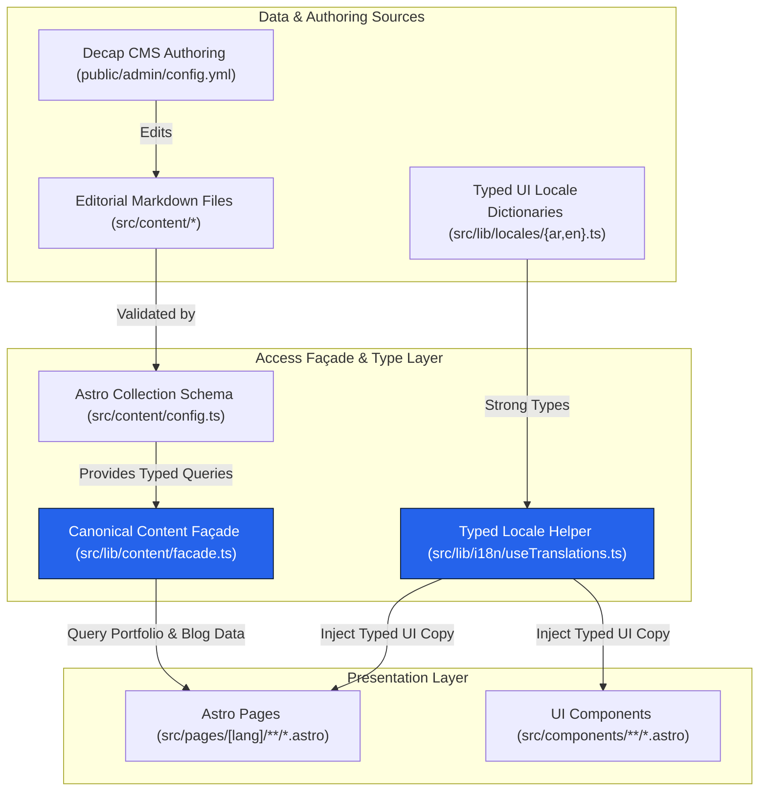

# ADR 001: Editorial Content Source and UI Locale Catalog Boundary

- **Status:** Approved (Wave 0 / Task ARC-001)
- **Decisions Implemented:** [AD-01](../../Master%20Refactoring%20Plan.md#architecture-decisions), [AD-02](../../Master%20Refactoring%20Plan.md#architecture-decisions)
- **Audit Compliance Items Addressed:** [CC-12](../../Constitution%20Compliance%20Audit.md#cc-12--architecture-contains-unproven-parallel-content-pipelines), [CC-07](../../Constitution%20Compliance%20Audit.md#cc-07--ui-translations-are-hardcoded-and-fragmented)
- **Cross-References:** [AD-03](../../Master%20Refactoring%20Plan.md#architecture-decisions), [AD-04](../../Master%20Refactoring%20Plan.md#architecture-decisions), [AD-05](../../Master%20Refactoring%20Plan.md#architecture-decisions), [AD-06](../../Master%20Refactoring%20Plan.md#architecture-decisions), [AD-07](../../Master%20Refactoring%20Plan.md#architecture-decisions)

---

## 1. Context & Problem Statement

The repository audit identified two significant content architecture violations:

1. **Parallel Content Architectures ([CC-12](../../Constitution%20Compliance%20Audit.md#cc-12--architecture-contains-unproven-parallel-content-pipelines)):** Production Astro pages (e.g., `blog/index.astro`, `projects/[slug].astro`, `services/[slug].astro`) directly call Astro's `getCollection()` helper. At the same time, an un-documented Content Hub pipeline (`src/lib/sdk/contentHubClient.ts`, `src/lib/pipelineOrchestrator.ts`, `src/lib/workers/*`) exists in the repository. There was no governing architecture boundary defining whether the pipeline layer or direct collection reads were canonical.
2. **Hardcoded & Fragmented UI Copy ([CC-07](../../Constitution%20Compliance%20Audit.md#cc-07--ui-translations-are-hardcoded-and-fragmented)):** UI components and page templates frequently declared ad-hoc `const t` objects or inline conditionals (`isAr ? "..." : "..."`), bypassing central translation abstractions (`src/lib/providers/translationProvider.ts`). This violated Constitution Articles 5, 6, and 11.

---

## 2. Architecture Decisions

### Decision AD-01: Canonical Editorial Content Source (`src/content`)
`src/content` is established as the single canonical source of truth for all editorial content (case studies, portfolio projects, service descriptions, and blog posts).
- All editorial collections are governed by Astro Content Collection schemas (`src/content/config.ts`) and authored via Decap CMS (`public/admin/config.yml`).
- Direct page imports of `getCollection()` will be consolidated behind a single canonical content access façade (`src/lib/content/facade.ts` under task `CNT-001`).
- The un-proven parallel Content Hub microservice modules (`src/lib/sdk/contentHubClient.ts`, etc.) are designated for usage analysis and eventual retirement/integration under `CNT-001`.

### Decision AD-02: Typed UI Locale Catalog
UI interface copy (navigation menus, CTA labels, form field prompts, metadata descriptions, section subtitles) is strictly separated from editorial markdown collections.
- A strongly-typed UI locale catalog system (`src/lib/locales/` or `src/i18n/`) will own all interface strings for supported locales (`ar` and `en`).
- Authoring UI strings directly within components, page templates, or inline ternary expressions is prohibited.
- UI components must access copy via typed dictionary lookup functions (e.g., `useTranslations(lang)`).

---

## 3. Data Flow & Boundary Diagram

The following Mermaid diagram specifies the canonical content and copy architecture flow:

---

## 4. Consequences

### Positive Consequences
- Resolves [CC-12](../../Constitution%20Compliance%20Audit.md#cc-12--architecture-contains-unproven-parallel-content-pipelines) by removing architectural ambiguity surrounding content retrieval.
- Resolves [CC-07](../../Constitution%20Compliance%20Audit.md#cc-07--ui-translations-are-hardcoded-and-fragmented) by eliminating hardcoded strings and providing full TypeScript autocomplete for UI copy.
- Enforces strict compliance with Constitution Articles 5, 6, 10, and 16.
- Prevents UI copy changes from breaking CMS schema contracts or requiring markdown edits.

### Negative / Trade-offs
- Requires migrating existing hardcoded UI strings across components to the typed locale catalog in task `FND-003`.
- Developers must add new UI copy keys to the locale dictionaries rather than typing quick inline strings.

---

## 5. Alternatives & Rejected Options

1. **Rejected Option 1: Storing UI copy inside `src/content/` markdown files.**
   - *Reason for Rejection:* Overcomplicates Decap CMS workflows and mixes static interface copy with dynamic editorial articles.
2. **Rejected Option 2: Retaining the parallel Content Hub SDK stack (`contentHubClient.ts`).**
   - *Reason for Rejection:* Introduces unneeded runtime complexity and network calls for a SSG/SSR Astro application, violating Constitution Article 17 (minimal dependencies).
3. **Rejected Option 3: Continuing inline string conditionals (`isAr ? "إرسال" : "Submit"`).**
   - *Reason for Rejection:* Direct violation of Constitution Article 5 (Centralized Translations) and Article 11 (No Duplicated Logic/Translations).

---

## 6. Rollback Implications

- **Rollback Strategy:** If the content façade or locale catalog needs to be reverted during Wave 1 or Wave 4, reverting the specific implementation commits (`FND-003` or `CNT-001`) will restore direct file calls without risking data loss, as the underlying markdown files in `src/content/` remain completely unchanged.
