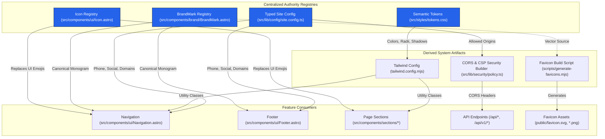

# ADR 002: Configuration, Design Tokens, and Visual Identity Boundaries

- **Status:** Approved (Wave 0 / Task ARC-001)
- **Decisions Implemented:** [AD-03](../../Master%20Refactoring%20Plan.md#architecture-decisions), [AD-04](../../Master%20Refactoring%20Plan.md#architecture-decisions), [AD-05](../../Master%20Refactoring%20Plan.md#architecture-decisions)
- **Audit Compliance Items Addressed:** [CC-01](../../Constitution%20Compliance%20Audit.md#cc-01--design-tokens-are-not-the-single-visual-authority), [CC-02](../../Constitution%20Compliance%20Audit.md#cc-02--forbidden-decorative-gradients-grids-and-glow-are-rendered), [CC-03](../../Constitution%20Compliance%20Audit.md#cc-03--identity-is-duplicated-no-logo-registry-exists), [CC-04](../../Constitution%20Compliance%20Audit.md#cc-04--unapproved-typefaces-and-direct-typography-declarations), [CC-05](../../Constitution%20Compliance%20Audit.md#cc-05--raw-colours-pure-white-arbitrary-radii-and-shadows-bypass-the-system), [CC-06](../../Constitution%20Compliance%20Audit.md#cc-06--built-in-emoji-are-used-as-ui-icons), [CC-08](../../Constitution%20Compliance%20Audit.md#cc-08--productcontact-configuration-is-scattered), [CC-13](../../Constitution%20Compliance%20Audit.md#cc-13--environment-endpoint-and-security-configuration-is-duplicated), [CC-15](../../Constitution%20Compliance%20Audit.md#cc-15--folder-and-asset-naming-are-inconsistent)
- **Cross-References:** [AD-01](../../Master%20Refactoring%20Plan.md#architecture-decisions), [AD-02](../../Master%20Refactoring%20Plan.md#architecture-decisions), [AD-06](../../Master%20Refactoring%20Plan.md#architecture-decisions), [AD-07](../../Master%20Refactoring%20Plan.md#architecture-decisions)

---

## 1. Context & Problem Statement

Multiple critical findings in [Constitution Compliance Audit.md](../../Constitution%20Compliance%20Audit.md) highlighted scattered configuration, ungoverned styling, and duplicated identity assets:

1. **Scattered Contact & Runtime Config ([CC-08](../../Constitution%20Compliance%20Audit.md#cc-08--productcontact-configuration-is-scattered), [CC-13](../../Constitution%20Compliance%20Audit.md#cc-13--environment-endpoint-and-security-configuration-is-duplicated)):** Phone number `201017749925`, WhatsApp URLs, social profile links, production domains, timeouts, and CORS allowed origins were hardcoded across `Footer.astro`, `Navigation.astro`, `Services.astro`, `privacy.astro`, `Layout.astro`, `vercel.json`, and API handlers.
2. **Design Token & Styling Bypass ([CC-01](../../Constitution%20Compliance%20Audit.md#cc-01--design-tokens-are-not-the-single-visual-authority), [CC-02](../../Constitution%20Compliance%20Audit.md#cc-02--forbidden-decorative-gradients-grids-and-glow-are-rendered), [CC-04](../../Constitution%20Compliance%20Audit.md#cc-04--unapproved-typefaces-and-direct-typography-declarations), [CC-05](../../Constitution%20Compliance%20Audit.md#cc-05--raw-colours-pure-white-arbitrary-radii-and-shadows-bypass-the-system)):** Authored code used unapproved font families (`Cinzel`, `Playfair Display`), hardcoded hex colors (`#38BDF8`), pure white (`#ffffff`), prohibited glowing background gradients, and raw Tailwind radii (`rounded-[32px]`), violating [DESIGN.md](../../DESIGN.md).
3. **Duplicated Logo & UI Emojis ([CC-03](../../Constitution%20Compliance%20Audit.md#cc-03--identity-is-duplicated-no-logo-registry-exists), [CC-06](../../Constitution%20Compliance%20Audit.md#cc-06--built-in-emoji-are-used-as-ui-icons)):** Identical SVG logo paths were duplicated across four `Navigation` contexts, `Footer`, and `Preloader`. Raw built-in emojis (`💡`, `📝`, `📉`) were used directly in rendered UI labels.

---

## 2. Architecture Decisions

### Decision AD-03: Single Typed Runtime & Site Configuration
A centralized module (`src/lib/config/site.config.ts` implemented in task `FND-004`) owns all site metadata, contact details, social links, API endpoints, rate limits, and CORS security policies.
- Contact phone number `201017749925`, WhatsApp message templates, social links, and domain definitions MUST be referenced exclusively through this module.
- Shared policy builders (`src/lib/security/policy.ts`) derive CSP rules and CORS allowed origins directly from site configuration.

### Decision AD-04: Enforceable Semantic Design Tokens
[DESIGN.md](../../DESIGN.md) is formalized into machine-readable CSS custom properties and extended Tailwind utility classes (`src/styles/tokens.css` implemented in `FND-001`).
- **Approved Colors:** Consultancy Blue (`#2563EB`), Alabaster Warm Light (`#F8F9FA`), Deep Navy Slate (`#0A192F`), Card White (`#FFFFFF`). Pure black and pure white background fills are prohibited.
- **Approved Typography:** Cormorant Garamond (Display headings) and Outfit (Body copy) exclusively. Unapproved font imports (`Cinzel`, `Playfair Display`) and Font Awesome CDN links are removed.
- **Forbidden Effects:** Linear/radial decorative gradients, background grids, and glowing card borders are eliminated in favor of clean solid surfaces, 1px borders, and ambient drop shadows.

### Decision AD-05: BrandMark and Icon Registry Ownership
Brand identity and UI iconography are encapsulated within centralized component registries (`VIS-002`, `VIS-003`).
- **BrandMark Component (`src/components/brand/BrandMark.astro`):** Encapsulates the canonical logo SVG paths and handles sizing/variants. Favicon files in `public/` are generated build outputs derived directly from `BrandMark` vectors via `scripts/generate-favicons.mjs`.
- **Icon Component (`src/components/ui/Icon.astro`):** Serves as the exclusive renderer for all UI icons. Built-in emojis and Font Awesome classes are replaced with registered SVG icon definitions.

---

## 3. Configuration & Identity Boundary Diagram

---

## 4. Consequences

### Positive Consequences
- Guarantees complete visual alignment with [DESIGN.md](../../DESIGN.md) across all breakpoints.
- Centralizes phone numbers and social links, eliminating hardcoded contact drift.
- Eliminates 6 duplicate inline SVG logo implementations and removes all raw UI emojis.
- Ensures favicons automatically sync with brand vector updates.

### Negative / Trade-offs
- Developers must register new icons in `Icon.astro` instead of inserting quick unicode emojis.
- Pull requests violating token rules will be blocked by automated CSS linter checks.

---

## 5. Alternatives & Rejected Options

1. **Rejected Option 1: Allowing raw Tailwind color/radius utility classes for rapid prototyping.**
   - *Reason for Rejection:* Direct violation of Constitution Articles 2, 14 and [DESIGN.md](../../DESIGN.md). Leads to fragmented visual regressions (CC-01, CC-05).
2. **Rejected Option 2: Retaining inline SVG markup inside each navbar/footer rendering.**
   - *Reason for Rejection:* Violates Constitution Article 4 (Logos from centralized registry) and Article 11 (No duplicated assets).
3. **Rejected Option 3: Storing contact phone numbers and social links in CMS markdown collections.**
   - *Reason for Rejection:* Violates Constitution Article 6 (Single Source of Truth) as contact configuration is runtime application data, not editorial article content.

---

## 6. Rollback Implications

- Reverting token definitions (`FND-001`) or identity components (`VIS-002`, `VIS-003`) involves rolling back isolated frontend component/style commits.
- Generated favicons can be re-compiled instantly using `node scripts/generate-favicons.mjs` without affecting content database states.
