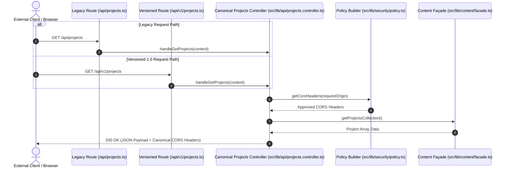

# ADR 003: Versioned API Routes and Thin Adapter Architecture

- **Status:** Approved (Wave 0 / Task ARC-001)
- **Decisions Implemented:** [AD-06](../../Master%20Refactoring%20Plan.md#architecture-decisions)
- **Audit Compliance Items Addressed:** [CC-11](../../Constitution%20Compliance%20Audit.md#cc-11--duplicate-api-contract-and-cors-logic), [CC-13](../../Constitution%20Compliance%20Audit.md#cc-13--environment-endpoint-and-security-configuration-is-duplicated)
- **Cross-References:** [AD-01](../../Master%20Refactoring%20Plan.md#architecture-decisions), [AD-02](../../Master%20Refactoring%20Plan.md#architecture-decisions), [AD-03](../../Master%20Refactoring%20Plan.md#architecture-decisions), [AD-04](../../Master%20Refactoring%20Plan.md#architecture-decisions), [AD-05](../../Master%20Refactoring%20Plan.md#architecture-decisions), [AD-07](../../Master%20Refactoring%20Plan.md#architecture-decisions)

---

## 1. Context & Problem Statement

The repository audit identified duplicated API logic and security configuration:

1. **Duplicate Route Implementations ([CC-11](../../Constitution%20Compliance%20Audit.md#cc-11--duplicate-api-contract-and-cors-logic)):** Endpoint handlers in `/api/projects.ts` vs `/api/v1/projects.ts` and `/api/health.ts` vs `/api/v1/health.ts` independently implemented CORS header injection, OPTIONS pre-flight handling, status payload formatting, and response structure. SHA-256 analysis confirmed they were parallel maintained codebases rather than lightweight wrappers or aliases.
2. **Duplicated Endpoint & Policy Configuration ([CC-13](../../Constitution%20Compliance%20Audit.md#cc-13--environment-endpoint-and-security-configuration-is-duplicated)):** CORS allowed origins, Content Security Policy headers, and timeout values were hardcoded separately inside individual API route files, `vercel.json`, and `src/middleware.ts`.

This violated Constitution Article 6 (Single Source of Truth), Article 10 (Architecture Boundaries), Article 11 (No Duplicated Logic), and Article 14 (Centralized Configuration).

---

## 2. Architecture Decision

### Decision AD-06: Thin Adapter Pattern for Versioned API Routes
All API endpoint business logic, schema validation, error handling, and security header injection are consolidated into canonical controller handlers residing in `src/lib/api/` (implemented in task `APP-003`).

- **Canonical Controllers:** Dedicated modules (e.g., `src/lib/api/projects.controller.ts`, `src/lib/api/health.controller.ts`) own request context parsing, data retrieval, response shaping, and policy header attachment via `src/lib/security/policy.ts`.
- **Thin Route Adapters:** Both legacy unversioned routes (`src/pages/api/*.ts`) and versioned routes (`src/pages/api/v1/*.ts`) MUST act as thin adapters containing zero business logic. They simply receive Astro API Context and delegate execution to the canonical controller.
- **Contract Parity:** Contract integration tests in task `APP-003` verify that `/api/projects` and `/api/v1/projects` return byte-for-byte identical status codes, CORS headers, OPTIONS responses, and JSON structures.

---

## 3. Thin Adapter Sequence Diagram

The following Mermaid diagram illustrates request execution through thin adapters to canonical controllers:

---

## 4. Consequences

### Positive Consequences
- Eliminates duplicate API code and resolves [CC-11](../../Constitution%20Compliance%20Audit.md#cc-11--duplicate-api-contract-and-cors-logic) and [CC-13](../../Constitution%20Compliance%20Audit.md#cc-13--environment-endpoint-and-security-configuration-is-duplicated).
- Guarantees complete backward compatibility for external callers using either `/api/*` or `/api/v1/*`.
- Ensures CORS origin policies and security headers updated in `site.config.ts` automatically apply across all API routes.

### Negative / Trade-offs
- Endpoint developers must make changes inside `src/lib/api/` controllers rather than editing route files under `src/pages/api/` directly.

---

## 5. Alternatives & Rejected Options

1. **Rejected Option 1: Deprecating and immediately deleting unversioned `/api/projects.ts` routes.**
   - *Reason for Rejection:* Would break existing client code, external integrations, or monitoring scripts that rely on the legacy path.
2. **Rejected Option 2: Maintaining parallel endpoint implementations with copy-pasted CORS code.**
   - *Reason for Rejection:* Direct violation of Constitution Articles 6, 10, 11, and 14. Leads to CORS drift and security vulnerabilities.
3. **Rejected Option 3: Using HTTP 301/308 redirects from `/api/projects` to `/api/v1/projects`.**
   - *Reason for Rejection:* Causes additional network round-trips for API callers and can fail for POST/OPTIONS pre-flight requests in strict CORS environments.

---

## 6. Rollback Implications

- **Rollback Safety:** If an issue occurs in a canonical controller, reverting task commit `APP-003` restores previous route handlers. Because API routes preserve identical signature interfaces, client applications experience zero breaking URL changes.
