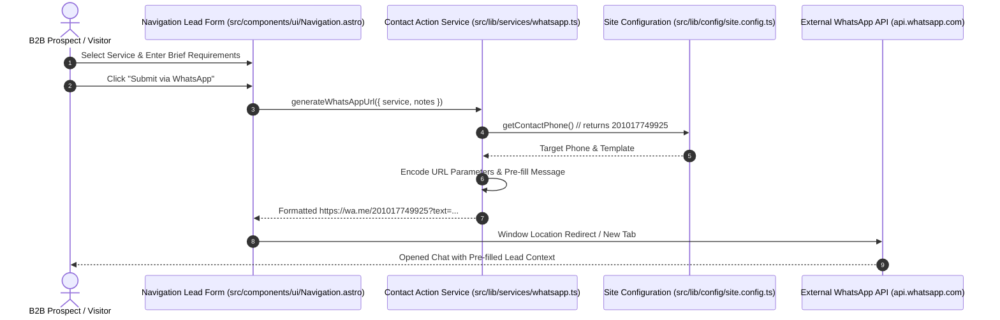

# ADR 004: Direct WhatsApp Lead Capture Architecture and Product UX Alignment

- **Status:** Approved (Wave 0 / Task ARC-001)
- **Decisions Implemented:** [AD-07](../../Master%20Refactoring%20Plan.md#architecture-decisions)
- **Audit Compliance Items Addressed:** [CC-14](../../Constitution%20Compliance%20Audit.md#cc-14--documentation-and-implementation-disagree-on-contact-ux)
- **Cross-References:** [AD-01](../../Master%20Refactoring%20Plan.md#architecture-decisions), [AD-02](../../Master%20Refactoring%20Plan.md#architecture-decisions), [AD-03](../../Master%20Refactoring%20Plan.md#architecture-decisions), [AD-04](../../Master%20Refactoring%20Plan.md#architecture-decisions), [AD-05](../../Master%20Refactoring%20Plan.md#architecture-decisions), [AD-06](../../Master%20Refactoring%20Plan.md#architecture-decisions), [CC-08](../../Constitution%20Compliance%20Audit.md#cc-08--productcontact-configuration-is-scattered), [CC-10](../../Constitution%20Compliance%20Audit.md#cc-10--repeated-cardcta-patterns-have-no-shared-component-boundary)

---

## 1. Context & Problem Statement

The repository audit identified a contradiction between product documentation and implemented component code:

- **Documentation & Implementation Mismatch ([CC-14](../../Constitution%20Compliance%20Audit.md#cc-14--documentation-and-implementation-disagree-on-contact-ux)):** [PRODUCT.md](../../PRODUCT.md) Design Principle 3 stated: *"Highly focused conversion pathways routing users directly to WhatsApp/email (the inline Contact section and contact modal have been deleted)."* However, `Navigation.astro` (lines 753–908) retained a functioning `whatsapp-lead-form` equipped with service category selection, custom requirement text inputs, and submission logic routing directly to WhatsApp.
- **Scattered Contact Logic ([CC-08](../../Constitution%20Compliance%20Audit.md#cc-08--productcontact-configuration-is-scattered), [CC-10](../../Constitution%20Compliance%20Audit.md#cc-10--repeated-cardcta-patterns-have-no-shared-component-boundary)):** Hardcoded target phone number `201017749925` and un-encoded URL builders were duplicated across `Navigation.astro`, `Footer.astro`, and `Services.astro`.

This violated Constitution Article 20 (Documentation must reflect implementation).

---

## 2. Architecture Decision

### Decision AD-07: Retain Direct WhatsApp Lead Capture & Reconcile PRODUCT.md
The existing interactive lead capture interface in `Navigation.astro` and direct WhatsApp conversion CTAs are officially retained as core application architecture.

1. **Retain Implementation:** The WhatsApp form in `Navigation.astro` and page CTAs represent high-ticket B2B conversion pathways essential to product goals.
2. **Centralize Action Service:** All WhatsApp URL generation, phone number retrieval, message pre-formatting, and telemetry tracking are consolidated into a shared contact action service (`src/lib/services/whatsapp.ts` implemented in task `APP-001`), consuming target phone number `201017749925` directly from `site.config.ts`.
3. **Reconcile Documentation (Task GOV-001):** [PRODUCT.md](../../PRODUCT.md) Design Principle 3 will be updated under task `GOV-001` to accurately describe the direct WhatsApp lead capture form and modal conversion flows, resolving document-code drift.

---

## 3. Contact Interaction Flow Diagram

The following Mermaid diagram outlines the end-to-end direct WhatsApp lead capture sequence:

---

## 4. Consequences

### Positive Consequences
- Resolves [CC-14](../../Constitution%20Compliance%20Audit.md#cc-14--documentation-and-implementation-disagree-on-contact-ux) by bringing product documentation into alignment with actual shipped UX.
- Eliminates hardcoded phone numbers (`201017749925`) and custom URL concatenation in UI components.
- Preserves high-converting direct contact channels for enterprise leads.

### Negative / Trade-offs
- Task `GOV-001` must update `PRODUCT.md` text to avoid future confusion during code reviews.

---

## 5. Alternatives & Rejected Options

1. **Rejected Option 1: Deleting the navigation WhatsApp form to match obsolete wording in PRODUCT.md.**
   - *Reason for Rejection:* Harms primary lead conversion functionality and degrades user experience. Code changes should fix documentation defects when the code represents intended business logic.
2. **Rejected Option 2: Replacing WhatsApp capture with a traditional backend email/server form.**
   - *Reason for Rejection:* Introduces unnecessary server complexity and friction for prospects. Direct WhatsApp chat provides immediate enterprise engagement consistent with [PRODUCT.md](../../PRODUCT.md) goals.
3. **Rejected Option 3: Leaving documentation and implementation permanently out of sync.**
   - *Reason for Rejection:* Direct violation of Constitution Article 20.

---

## 6. Rollback Implications

- **Rollback Safety:** The contact action service (`APP-001`) and documentation update (`GOV-001`) carry zero risk to database state. If reverted, standard fallback WhatsApp links remain fully functional.
