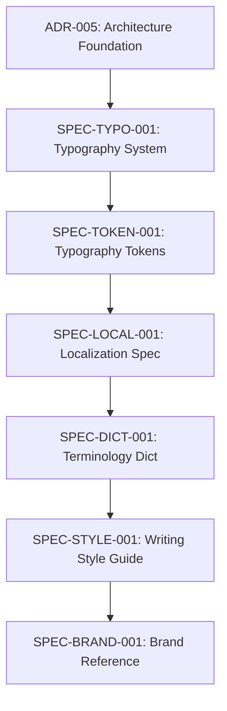

# ADR-005: Typography, Bilingual Language & Brand Communication Architecture

* **Status:** Accepted (Revision 2.0)
* **Date:** 2026-08-01
* **Architectural Domain:** Design System Architecture / Internationalization Architecture / Brand Governance
* **Authors:** Principal Software Architect & Design System Architect

---

## 1. Architecture Decision Record (ADR) Metadata

### Context
The Mousa Analytics platform has evolved as a bilingual (Arabic/English) enterprise analytics platform and web experience. During rapid system expansion, typography styling, text sizing, brand naming, writing style, and localization decisions were made ad-hoc inside individual page templates and UI components.

This decentralized approach created architectural debt, including:
* Inconsistent font size declarations and ad-hoc visual overrides.
* Literal translations between English and Arabic that failed to preserve brand voice and semantic clarity.
* Coupling of typography rules across Latin and Arabic scripts, incorrectly applying Latin optical tracking and layout assumptions to Arabic script rendering.
* Scattered brand identity terminology across component files without a single canonical source of truth.

### Scope

#### What This ADR Governs:
This ADR establishes high-level architectural philosophy, domain boundaries, ownership models, governance structures, and non-negotiable principles for:
* Bilingual communication architecture and domain isolation.
* Brand identity naming governance and canonical identity enforcement.
* Localization philosophy and semantic translation principles.
* Terminology governance and controlled business vocabulary architecture.
* Typography architecture philosophy and script-decoupling principles.
* Bi-directional (RTL/LTR) rendering directionality ownership.
* Accessibility philosophy and minimum legibility standards.

#### What This ADR Does NOT Govern (Out of Scope):
This ADR intentionally DOES NOT govern implementation details or technical concrete values. The following items SHALL NOT be defined within this ADR and are delegated exclusively to decoupled downstream specifications:
* Typography tokens and CSS variables.
* Font families and font selections.
* Font sizes, rem values, pixels, and line heights.
* Letter spacing (tracking) and optical sizing values.
* CSS rules, SCSS mixins, or Tailwind configuration objects.
* Design system color palettes or spatial layout tokens.
* UI component implementation or page-level markup.

---

### Decision Drivers
The following architectural drivers necessitated this formal decision:

1. **Architectural Scalability:** The system MUST scale across new features, localized routes, and product modules without exponential growth in styling complexity.
2. **Global Consistency:** Every digital asset SHALL present unified brand identity, controlled terminology, and harmonious typographic presentation.
3. **Accessibility Compliance:** Text rendering and layout structures MUST satisfy WCAG 2.1 AA/AAA accessibility standards by default.
4. **Internationalization Integrity:** The system MUST treat Arabic and English as equal, first-class, script-independent communication systems.
5. **Long-Term Maintainability:** Decoupling communication domains reduces technical debt and prevents localized styling regression during refactoring.
6. **Single Source of Truth:** Every business concept, brand title, and typographic rule MUST originate from one authoritative specification.
7. **Separation of Concerns:** Architectural rules SHALL remain decoupled from CSS frameworks and component implementation layers.

---

### Decision
We decide to establish a centralized **Typography, Bilingual Language & Brand Communication Architecture**. 

Under this architecture:
1. **Communication Domain Isolation:** Typography, writing, brand naming, localization, terminology, and bi-directional rendering SHALL be formal, decoupled architectural domains governed by independent downstream specifications.
2. **Strict Bidi System Decoupling:** The Arabic and English typography systems SHALL be declared as two independent typographic entities. They MAY share high-level visual brand identity principles, but they SHALL share zero typographic metrics, zero tracking rules, and zero font family hierarchies.
3. **Decentralization Prohibition:** Typography styling, brand names, and translation strings MUST NOT be defined inline within individual UI components or page files.
4. **Architectural Governance over Implementation:** All future text styling, tokenization, translation catalogs, and font loading mechanisms MUST consume centralized downstream specifications derived from this ADR.

---

### Consequences

#### Positive Consequences:
* Establishes a predictable, scalable architectural foundation for all bilingual communications and visual presentation layers.
* Eliminates font drift, arbitrary styling overrides, and localized text distortion across English and Arabic interfaces.
* Ensures Arabic typography is designed specifically for Arabic script readability rather than treated as a sub-set of Latin typography.
* Guarantees brand naming consistency and controlled terminology across all digital touchpoints.

#### Negative Consequences / Trade-offs:
* Requires developer discipline to strictly consume centralized design tokens and localized content facade APIs instead of writing ad-hoc utility classes.
* Requires creating and maintaining dedicated downstream specifications (e.g., Typography Tokens Spec, Terminology Dictionary, Writing Style Guide).

---

### Alternatives Considered
* **Single Shared Typography Scale:** Applying a single unified typographic scale and identical tracking/font rules to both Arabic and English. *Rejected because Arabic script has fundamentally different line-height, optical density, and letterform connectivity requirements than Latin script.*
* **Component-Level Inline Styling:** Allowing individual page templates to customize typography and translations locally. *Rejected due to severe maintenance overhead, visual fragmentation, and violation of the Single Source of Truth principle.*

---

## 2. Architectural Constraints

The following non-negotiable architectural constraints govern all presentation and communication layers:

1. **No Component Ownership of Typography:** No individual UI component or page template SHALL own or redefine typography rules, font sizes, or text weights.
2. **No Page Ownership of Terminology:** No page file or content layout SHALL invent business terms or override approved business nomenclature.
3. **No Translation Ownership of Business Meaning:** No translation file or localization key SHALL alter the core business meaning or value proposition of source content.
4. **No Component Ownership of Brand Identity:** No UI component SHALL redefine, abbreviate, or re-render the canonical brand title or founder identity.
5. **No Bypassing Central Governance:** No presentation layer, build script, or third-party integration SHALL bypass centralized architectural governance.

---

## 3. Problem Statement

The platform currently exhibits several structural communication and presentation vulnerabilities:

1. **Inconsistent Terminology:** Business concepts, service offerings, and system metrics are named differently across different pages and translation files.
2. **Duplicated Naming:** Multiple variations of the brand name exist in components, metadata tags, and footer blocks.
3. **Translation Drift:** Arabic translations were historically performed literally from English text rather than engineered semantically to convey equivalent business value.
4. **Typographic Fragmenting:** Font sizes, line heights, and weights are declared arbitrarily across components without central tokenized boundaries.
5. **Lack of Governance:** No formal policy governs how new components declare text styling, handle responsive typography, or manage multilingual copy.
6. **Lack of Writing Standards:** Tone, voice, and sentence structures vary between marketing blocks, legal pages, and technical UI interfaces.
7. **Coupled RTL/LTR Treatment:** Latin-specific tracking (letter spacing) and uppercase transformations are incorrectly inherited by Arabic text nodes in certain components, degrading cursive script legibility.
8. **Inconsistent Brand Communication:** Technical capabilities and client outcomes are communicated with varying levels of formality across different application views.

---

## 4. Architectural Vision

The Mousa Analytics platform SHALL consist of **independent but connected communication domains**. 

Typography is not an isolated visual styling layer; it is the visual manifestation of a larger, unified **Brand Communication Architecture**. Visual presentation (typography), verbal presentation (writing and tone), identity presentation (brand naming), and language translation (localization) MUST operate under synchronized architectural governance while remaining structurally decoupled.

---

## 5. Architecture Overview

The Brand Communication Architecture consists of nine independent, governed domains:

```
+-----------------------------------------------------------------------------------+
|                        BRAND COMMUNICATION ARCHITECTURE                           |
+-------------------+-------------------+-------------------+-----------------------+
|  1. Brand         |  2. Brand         |  3. Typography    |  4. Writing           |
|     Identity      |     Naming        |     Architecture  |     Standards         |
+-------------------+-------------------+-------------------+-----------------------+
|  5. Localization  |  6. RTL / LTR     |  7. Terminology   |  8. Content           |
|     Philosophy    |     Rendering     |     Governance    |     Governance        |
+-------------------+-------------------+-------------------+-----------------------+
|  9. Accessibility Philosophy                                                      |
+-----------------------------------------------------------------------------------+
```

### Domain Responsibilities:
1. **Brand Identity Domain:** Defines core visual philosophy, corporate values, authority signals, and aesthetic attributes.
2. **Brand Naming Domain:** Governs the official canonical representation of the brand title, founder identity, and trademark usage across all languages.
3. **Typography Architecture Domain:** Governs visual text rendering, structural hierarchies, readability parameters, and script-specific font systems.
4. **Writing Standards Domain:** Governs voice, tone, sentence construction, capitalization, and language formality across user contexts.
5. **Localization Philosophy Domain:** Governs semantic equivalence, cultural adaptation, and non-literal message alignment between supported languages.
6. **RTL/LTR Rendering Domain:** Governs layout directionality, bi-directional text flow, numerical formatting, punctuation, and mixed-language string handling.
7. **Terminology Governance Domain:** Governs controlled business vocabulary, preventing synonym drift and enforcing approved technical terms.
8. **Content Governance Domain:** Governs content access boundaries, translation fallback mechanics, and content facade API integrity.
9. **Accessibility Philosophy Domain:** Governs readability thresholds, contrast requirements, text zoom scaling, and WCAG compliance.

---

## 6. Brand Naming Governance

Brand identity naming is subject to strict architectural governance:

* **Canonical Identities:** The brand SHALL have exactly ONE official canonical English identity and exactly ONE official canonical Arabic identity.
* **Central Consumption:** All components, pages, header navigation blocks, footers, meta tags, and structured data schemas MUST consume these canonical identities from the centralized configuration layer.
* **Zero Component Innovation:** No page, component, modal, script, or stylesheet SHALL be permitted to invent new wording, abbreviate, or alter the canonical brand name.
* **Translation Invariance:** No localization file or translation provider MAY modify the official canonical brand identities.

---

## 7. Localization Philosophy

Localization within the platform is engineered as a **semantic communication process**, not a word-for-word translation process:

* **Equivalent Value Delivery:** Arabic and English communications MUST convey equivalent strategic business value and emotional resonance, regardless of structural linguistic differences.
* **Cultural and Contextual Precision:** Phrasing MUST feel native, natural, and authoritative in both Arabic and English. Direct literal translation is STRICTLY PROHIBITED.
* **Independent Structural Copy:** English and Arabic copy blocks SHALL be permitted to vary in character count, word choice, and sentence length to achieve natural phrasing without compromising message integrity.

---

## 8. Writing Governance

Writing standards operate independently from language translation. The Writing Governance domain defines:

* **Tone and Voice:** Authoritative, precise, enterprise-grade, and results-focused.
* **UI Microcopy:** Clear, action-oriented button labels, concise form field instructions, and helpful error messages.
* **Capitalization and Title Rules:** Enforcing strict capitalization standards for English headers and proper grammatical structures for Arabic titles.
* **Contextual Formality:** Adapting voice appropriateness between technical documentation, legal agreements, executive dashboards, and marketing highlights.

---

## 9. Terminology Governance

To maintain professional credibility, the platform requires a **Controlled Vocabulary Architecture**:

* **One Business Concept, One Approved Pair:** Every technical, analytical, or service concept MUST map to exactly ONE approved English term and exactly ONE approved Arabic term.
* **Prohibition of Synonym Drift:** Content authors and developers MUST NOT substitute approved terms with arbitrary synonyms (e.g., mixing "Dashboard", "Control Panel", and "Analytics Screen" for the same feature).
* **Centralized Dictionary Enforcement:** Approved terms SHALL be declared in a centralized terminology dictionary specification and consumed systematically.

---

## 10. Typography Architecture

The Typography Architecture domain is governed by the following core tenets:

* **Typography is Semantic:** Text styles convey structural hierarchy and functional meaning (e.g., headings, body, labels, metadata), not arbitrary aesthetics.
* **Typography is Language-Aware:** Typographic rules MUST adapt dynamically to script requirements rather than imposing Latin rules onto Arabic text.
* **Typography is Accessibility-Aware:** Legibility, minimum readable bounds, and line-height spacing SHALL take precedence over visual compactness.
* **Centralized Decision Boundary:** Typography rules SHALL be declared exclusively in central architecture specifications. Component-level font styling overrides are STRICTLY PROHIBITED.

---

## 11. Arabic Typography Principles

Arabic typography is governed by dedicated architectural principles:

* **Architectural Independence:** Arabic typography is an independent font system. It MUST NOT be derived from Latin typography.
* **Cursive Script Integrity:** Arabic typography MUST respect the natural cursive connectivity (`Huroof`) of Arabic calligraphy. 
* **Readability First:** Diacritic headroom, vertical letterform clearance, and stroke density SHALL take absolute priority over compact vertical layout grids.
* **Diacritic Protection:** Line heights MUST provide sufficient vertical space to prevent diacritic (`Tashkeel`) overlap or clipping.
* **Centralized Governance:** All Arabic typography rules, font selections, and scale tokenization SHALL be governed centrally in downstream specifications.

---

## 12. English Typography Principles

English typography is governed by functional communication domains:

* **Editorial Domain:** High-contrast serif typography applied to primary headlines and executive editorial statements to establish authority.
* **UI Domain:** High-clarity sans-serif typography applied to navigation controls, buttons, form inputs, and system interfaces.
* **Data Domain:** Tabular monospace typography applied to financial figures, analytical metrics, code snippets, and structured technical data.
* **Marketing & Documentation Domains:** Specialized layout hierarchies tailored for rapid scanning, legibility, and technical reading.

---

## 13. RTL / LTR Architecture

The bi-directional rendering architecture governs directionality ownership across application layers:

* **Directional Context:** Overall document flow (`dir="rtl"` / `dir="ltr"`) SHALL be controlled at the layout root based on active locale.
* **Numerals & Technical Data:** Financial values, analytical metrics, percentages, dates, and code blocks MUST retain clear, unambiguous directional and tabular alignment.
* **Bi-directional Integrity:** Mixed-language strings (e.g., English brand names within Arabic paragraphs) MUST maintain correct reading order and punctuation placement.
* **UI Alignment Inversion:** Flex layouts, grid positioning, form icons, navigation drawers, and table columns MUST invert automatically based on active language direction.

---

## 14. Accessibility Philosophy

Accessibility is an integral architectural requirement of typography:

* **Legibility Floor:** All text elements MUST satisfy minimum readable size thresholds to ensure readability across mobile and desktop displays.
* **Visual Contrast Compliance:** Text colors against background surfaces MUST satisfy standard WCAG 2.1 contrast guidelines.
* **Relative Scaling Support:** All typography dimensions MUST scale linearly when users increase browser zoom levels up to 200%.

---

## 15. Ownership & Governance Model

Architectural integrity relies on role-based ownership:

| Architectural Role | Area of Responsibility | Governance Scope |
|---|---|---|
| **Design System Architect** | Typography Architecture & Design Tokens | Governs ADR-005, `SPEC-TYPO-001`, `SPEC-TOKEN-001` |
| **Brand Identity Owner** | Brand Naming & Trademark Integrity | Governs `SPEC-BRAND-001`, canonical identity keys |
| **Localization Architect** | Translation Strategy & Bidi Rendering | Governs `SPEC-LOCAL-001`, `SPEC-RTL-001`, Content Facades |
| **Lead Content Editor** | Terminology Dictionary & Writing Style | Governs `SPEC-DICT-001`, `SPEC-STYLE-001` |
| **Accessibility Lead** | WCAG Compliance & Minimum Thresholds | Governs `SPEC-A11Y-001`, contrast and zoom rules |

---

## 16. Architecture Evolution & Change Management

Architecture is a living framework that evolves under structured governance:

1. **ADR Primacy:** This ADR represents the foundational policy. No downstream specification or code implementation MAY contradict this ADR without an explicit superseding ADR.
2. **Specification Revisions:** Downstream specifications (e.g., `SPEC-TYPO-001`) MAY be revised independently by their respective Role Owners provided they strictly comply with ADR-005 constraints.
3. **Deprecation Strategy:** When a typographic pattern or terminology key is deprecated, it SHALL be marked with a 60-day migration notice before removal.
4. **Amendment Process:** Amendments to ADR-005 require approval from the Design System Architect and Localization Architect.

---

## 17. Enterprise Dependency Hierarchy

The following diagram defines the mandatory unidirectional dependency flow from architectural policy down to code implementation and automated auditing:

```
                          [ ADR-005 Architectural Decision Record ]
                                             |
                                             v
                         +-------------------+-------------------+
                         |                                       |
                         v                                       v
         [ SPEC-BRAND-001: Brand Naming ]        [ SPEC-LOCAL-001: Localization ]
                         |                                       |
                         v                                       v
        [ SPEC-DICT-001: Terminology Dict ]      [ SPEC-STYLE-001: Writing Style ]
                         |                                       |
                         +-------------------+-------------------+
                                             |
                                             v
                        [ SPEC-TYPO-001: Typography Design System ]
                                             |
                                             v
                         [ SPEC-TOKEN-001: Design Tokens & CSS ]
                                             |
                                             v
                      [ Codebase Implementation: Astro / UI Primitives ]
                                             |
                                             v
                         [ CI Automated Audit: Vitest / Linter ]
```

---

## 18. Compliance & Architectural Enforcement

* **Mandatory Compliance:** Every current and future implementation in the Mousa Analytics codebase MUST comply with ADR-005 and its downstream specifications.
* **Architectural Defects:** Any pull request or commit containing inline typography overrides, unauthorized brand renamings, or literal translation bypasses SHALL be flagged as a **Blocking Architectural Defect**.
* **Architecture Primacy:** In any conflict between implementation code and ADR-005, **ADR-005 SHALL take absolute precedence**.

---

## 19. ADR Success Criteria

This ADR SHALL be considered successfully adopted when all the following criteria are verified:

1. **Single Canonical Naming:** 100% of brand references consume central canonical identity tokens.
2. **Zero Inline Typography Overrides:** Zero arbitrary font sizes (`text-[...px]`) or font-family overrides exist in UI components.
3. **Zero Terminology Drift:** 100% of business terms across English and Arabic catalogs match `SPEC-DICT-001`.
4. **Script Independence Verified:** Arabic routes render dedicated, script-optimized typography without Latin tracking artifacts.
5. **Downstream Roadmap Complete:** Specifications `SPEC-BRAND-001` through `SPEC-A11Y-001` are fully authored and active.

---

## 20. Architectural Risks

The following risks are managed under this architecture:

* **Risk of Governance Bypass:** Developers resorting to ad-hoc Tailwind classes to meet tight deadlines. *Mitigation: Automated Vitest CI lint rules (`components.test.ts` and `locale.test.ts`).*
* **Risk of Terminology Drift:** Content authors introducing unapproved business synonyms over time. *Mitigation: Strict dictionary governance via `SPEC-DICT-001`.*
* **Risk of Fragmented Implementation:** Desynchronization between English and Arabic component states. *Mitigation: Single Content Facade API enforced by `ContentFacade`.*
* **Risk of Documentation Divergence:** Codebase changing without updating downstream specifications. *Mitigation: Mandatory architectural review during PR approval.*

---

## 21. Strengthened Downstream Specifications Roadmap

The architectural framework established by ADR-005 delegates concrete implementation rules to eight specialized downstream specifications:



### 1. `SPEC-TYPO-001`: Typography Design System Specification
* **Purpose:** Define explicit typographic font families, scale tiers, line heights, and script rules.
* **Responsibility:** Author dedicated Arabic and English visual font specifications.
* **Inputs:** ADR-005.
* **Outputs:** Typography scale matrix, font family hierarchy, line height rules.
* **Dependencies:** ADR-005.
* **Owner:** Architecture Owner.

### 2. `SPEC-TOKEN-001`: Design Tokens & CSS Mapping Specification
* **Purpose:** Translate typographic specifications into actionable code tokens and theme variables.
* **Responsibility:** Map scale tokens to design tokens, theme variables, and utility classes.
* **Inputs:** `SPEC-TYPO-001`.
* **Outputs:** Design tokens, theme variables, styling rules.
* **Dependencies:** `SPEC-TYPO-001`.
* **Owner:** Architecture Owner.

### 3. `SPEC-LOCAL-001`: Localization Architecture Specification
* **Purpose:** Govern translation workflow, catalog structure, and semantic equivalence rules.
* **Responsibility:** Define catalog structure, content fallback rules, and content access boundaries.
* **Inputs:** ADR-005, `SPEC-TOKEN-001`.
* **Outputs:** Localization catalogs, translation contracts.
* **Dependencies:** ADR-005, `SPEC-TOKEN-001`.
* **Owner:** Localization Owner.

### 4. `SPEC-DICT-001`: Terminology Dictionary Specification
* **Purpose:** Eliminate synonym drift across marketing and technical UI interfaces.
* **Responsibility:** Author controlled vocabulary pairs mapping 1-to-1 between English and Arabic.
* **Inputs:** `SPEC-LOCAL-001`.
* **Outputs:** Approved business vocabulary pairs.
* **Dependencies:** `SPEC-LOCAL-001`.
* **Owner:** Content Owner.

### 5. `SPEC-STYLE-001`: Writing Style & Tone Guide
* **Purpose:** Enforce consistent voice, formality, and sentence structure across all views.
* **Responsibility:** Define grammar standards, capitalization rules, microcopy patterns, and tone matrix.
* **Inputs:** `SPEC-DICT-001`.
* **Outputs:** Microcopy guidelines, copy style guide.
* **Dependencies:** `SPEC-DICT-001`.
* **Owner:** Content Owner.

### 6. `SPEC-BRAND-001`: Brand Naming Specification
* **Purpose:** Provide the minimal architectural reference for canonical brand identities.
* **Responsibility:** Establish canonical brand inventory fields, core naming rules, and ownership roles.
* **Inputs:** `SPEC-STYLE-001`, `SPEC-DICT-001`.
* **Outputs:** Approved canonical brand inventory.
* **Dependencies:** `SPEC-STYLE-001`, `SPEC-DICT-001`.
* **Owner:** Business Owner.

