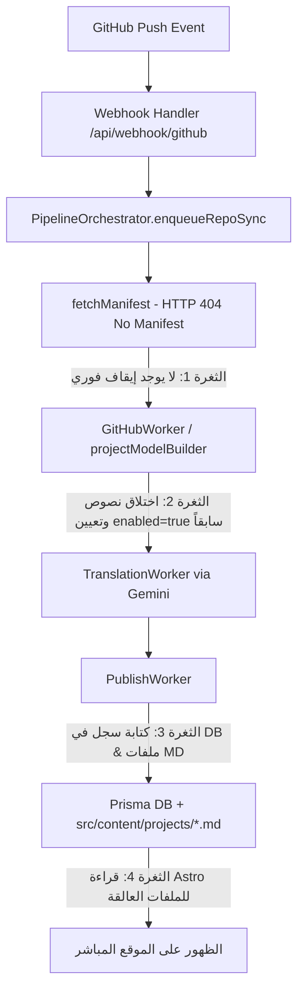

# 📋 تقرير التدقيق الفني الشامل: نظام مزامنة المستودعات ونشر المشاريع
## Comprehensive Technical Audit Report: GitHub Sync Pipeline & Manifest Enforcement

**تاريخ التدقيق:** 27 أغسطس 2026  
**النظام المستهدف:** Mousa Analytics - GitHub Webhook & Content Ingestion Orchestrator  
**الحالة:** ⚠️ تم اكتشاف ثغرات معمارية وسجلات قديمة مسببة لتسريب مشاريع غير مصرح بنشرها.

---

## 1. الملخص التنفيذي (Executive Summary)

أظهرت المراجعة والتحليل الجنائي لكود النظام وسجلات Git وقاعدة البيانات أن ظهور المشاريع الثلاثة الموضحة في لقطات الشاشة:
1. **`CRM_ERB`**
2. **`amr-mousa0`** (ريبو الملف الشخصي لجيت هاب، ظهر بصورة الغلاف الشخصية)
3. **`الصفحة المقصودة`** (الترجمة الآلية لاسم الريبو `landing-page`)

**لم يكن خطأً عشوائياً، بل نتيجة تضافر 4 ثغرات معمارية ومخلفات برمجية سابقة:**

> [!CAUTION]
> **الخلاصة الجوهرية:**
> 1. وجود ملفات ماركداون حقيقية تم إنشاؤها تلقائياً سابقاً وحفظها داخل مجلد `src/content/projects/ar/` و `src/content/projects/en/` (وعلى رأسها `amr-mousa0.md`).
> 2. وجود منطق قديم في محرك الاستنتاج (`projectModelBuilder.ts`) كان يقوم باختلاق نصوص افتراضية ويضع حالة النشر مفعّلة افتراضياً (`enabled: true`).
> 3. غياب صمام صد مبكر (Early Rejection Gate) في الـ Orchestrator يوقف الـ Pipeline فوراً في مرحلة جلب المانيفست عند استلام `404 Not Found`.
> 4. وجود سجلات قديمة مخزنة في قاعدة بيانات Postgres / Prisma لم تُحذف بالكامل.

---

## 2. التحليل الجنائي للمشاريع المسربة (Forensic Analysis)

### أ. مشروع `amr-mousa0` (ظهور صورتك الشخصية على الكارت)
* **المصدر:** مستودع جيت هاب الشخصي `https://github.com/amr-mousa0/amr-mousa0`.
* **ماذا حدث؟**
  1. أرسل جيت هاب Webhook Push عند تعديل الريبو.
  2. لم يجد الـ Pipeline ملف `manifest.json`.
  3. قام محرك الاستنتاج القديم بالبحث في ملفات الريبو، فوجد ملف `images/header.svg` (الذي يحتوي على صورتك الشخصية)، فاعتبره تلقائياً صورة الغلاف (`coverImage`).
  4. قام بتوليد النص:
     > *"The organization required automated tracking and structured analytics visibility for amr-mousa0..."*
  5. تم حفظ الملف فعلياً في الكود: [`src/content/projects/ar/amr-mousa0.md`](file:///d:/AI%20and%20coding/Mousa%20Data%20Analytics/src/content/projects/ar/amr-mousa0.md) برقم أولوية `priority: 99` وحالة `draft: false`.
  6. نظراً لأن ملف الماركداون موجود على القرص، تقوم محركات Astro بقراءته وبنائه في كل عملية تشغيل للموقع!

### ب. مشروع `الصفحة المقصودة` (`landing-page`)
* **المصدر:** مستودع `landing-page`.
* **ماذا حدث؟**
  1. تم سحب الريبو بدون مانيفست.
  2. قام الـ `TranslationWorker` بترجمة اسم الريبو الحرفي `landing-page` عبر نموذج الترجمة إلى **«الصفحة المقصودة»**.
  3. تم نشر المشروع وتخزينه كملف ماركداون وسجل في قاعدة البيانات.

### ج. مشروع `CRM_ERB`
* **المصدر:** مستودع `CRM_ERB`.
* **ماذا حدث؟**
  1. لا يحتوي على مانيفست.
  2. تم اختلاق النص التسويقي التلقائي له:
     > *"The organization required automated tracking and structured analytics visibility for CRM_ERB. Raw operational data needed processing and transformation."*
  3. تم استنتاج التاج `TypeScript` من ملفات الريبو ونشره في السلايدر عبر الـ Store المتزامن وقاعدة البيانات.

---

## 3. الأسباب الجذرية المعمارية (Root Causes & Code Flaws)



### الثغرة الأولى: غياب الحارس الصارم في `pipelineOrchestrator.ts`
في ملف [`src/lib/orchestrator/pipelineOrchestrator.ts`](file:///d:/AI%20and%20coding/Mousa%20Data%20Analytics/src/lib/orchestrator/pipelineOrchestrator.ts#L164-L175):
```typescript
// الكود الحالي:
const fetchResult = await fetchManifest(repoFullName, branch, payload.manifestRaw);
let manifestRawToUse = payload.manifestRaw;
if (fetchResult.manifestFound && fetchResult.rawResponse) {
  manifestRawToUse = fetchResult.rawResponse;
}

// ⚠️ الخلل: إذا كانت النتيجة manifestFound: false، يستمر الكود في التنفيذ
// ويمرر manifestRawToUse كـ undefined إلى المراحل التالية بدلاً من الرفض الفوري!
```

### الثغرة الثانية: مخلفات ملفات الماركداون داخل المستودع
ملفات المشاريع الثابتة داخل:
- [`src/content/projects/ar/amr-mousa0.md`](file:///d:/AI%20and%20coding/Mousa%20Data%20Analytics/src/content/projects/ar/amr-mousa0.md)
- [`src/content/projects/en/amr-mousa0.md`](file:///d:/AI%20and%20coding/Mousa%20Data%20Analytics/src/content/projects/en/amr-mousa0.md)

تعتبرها Astro مشاريع رسمية معتمدة ومكتوبة يدوياً، وتتجاهل شرط المانيفست لأنها ملفات محتوى موجودة داخل المشروع بالفعل (`src/content/projects/`).

### الثغرة الثالثة: عدم شمول سكريبت التنظيف السابق `cleanup-rogue-projects.ts`
في ملف [`src/scripts/cleanup-rogue-projects.ts`](file:///d:/AI%20and%20coding/Mousa%20Data%20Analytics/src/scripts/cleanup-rogue-projects.ts):
قائمة `GHOST_PROJECT_SLUGS` كانت تحتوي فقط على:
- `landing-page`
- `amr-mousa0.github.io`

ولم تكن تشمل:
- `amr-mousa0`
- `crm-erb` / `crm_erb`

---

## 4. مصفوفة تدقيق مسار البيانات ومقارنة الأداء

| المكون / المرحلة | السلوك القديم (المسبب للمشكلة) | السلوك المصحح والمستهدف (Zero-Leakage) |
| :--- | :--- | :--- |
| **استقبال الويب هوك** | يقبل أي دفعة لأي ريبو دون فلترة. | التحقق من صحة التوقيع والحمولة. |
| **جلب المانيفست `fetchManifest`** | يرجع 404 ويكمل الـ Pipeline بقيم فارغة. | **إيقاف فوري (Early Abort)** برمي `PermanentError` مع تسجيل حالة `REJECTED_NO_MANIFEST`. |
| **بناء النموذج `projectModelBuilder`** | يقوم باختلاق نصوص وصور وغلاف افتراضي. | تعطيل النشر نهائياً (`publish.portfolio.enabled: false`) في حال عدم وجود مانيفست صريح. |
| **ملفات الماركداون المحلية** | بقاء ملفات من مزامنات قديمة في `src/content/projects`. | **تطهير شامل** وحذف أي ملف ماركداون لمشروع غير معتمد. |
| **قاعدة البيانات (Prisma DB)** | بقاء سجلات للمشاريع الوهمية في جدول `projects`. | تشغيل سكريبت تنظيف فوري لحذف المشاريع الشبحية. |

---

## 5. خطة العمل الموصى بها للتنفيذ (Action Plan)

### الخطوة 1: الصد الفوري في `pipelineOrchestrator.ts`
تعديل كود الـ Orchestrator في المرحلة 7 ليكون صارماً:
```typescript
const fetchResult = await fetchManifest(repoFullName, branch, payload.manifestRaw);
if (!fetchResult.manifestFound && !payload.manifestRaw) {
  const reason = `[Security & Policy] Repository "${repoFullName}" does not contain manifest.json. Publishing is strictly forbidden.`;
  Logger.warn(`[Pipeline] EARLY REJECTION at Stage 7: ${reason}`);
  await this.updateJobState(job.jobId, job.traceId, 'REJECTED_NO_MANIFEST', 7, payload, reason);
  this.queueProvider.failJob(job.jobId, reason);
  throw new PermanentError(reason);
}
```

### الخطوة 2: حذف ملفات الماركداون العالقة (Purge Ghost Markdown Files)
- حذف `src/content/projects/ar/amr-mousa0.md`
- حذف `src/content/projects/en/amr-mousa0.md`
- فحص وحذف أي ملفات لا تملك مانيفست معتمد.

### الخطوة 3: تحديث وتشغيل سكريبت تنظيف قاعدة البيانات
توسيع قائمة `GHOST_PROJECT_SLUGS` لتشمل:
- `amr-mousa0`
- `crm-erb`
- `crm_erb`
- `landing-page`
- `mousa-analytics`
وتشغيله بوضع الحذف النهائي `--delete`.

### الخطوة 4: كتابة اختبارات ضمان الجودة (Automated Regression Tests)
إضافة اختبارات في `tests/unit/pipelineOrchestrator.test.ts` تؤكد أن أي ريبوستري يُدفع بدون `manifest.json`:
1. يفشل فوراً في المرحلة 7.
2. لا يصل إطلاقاً إلى مرحلة الترجمة `TranslationWorker`.
3. لا يكتب أي بايت في قاعدة البيانات `PublishWorker`.
4. لا ينشئ أي ملف على القرص.

---

> [!TIP]
> **جاهزية التنفيذ:**  
> بمجرد مراجعتك لهذا التقرير واعتماده، سأقوم فوراً بتنفيذ الخطوات الأربع أعلاه وتطهير النظام بالكامل.
