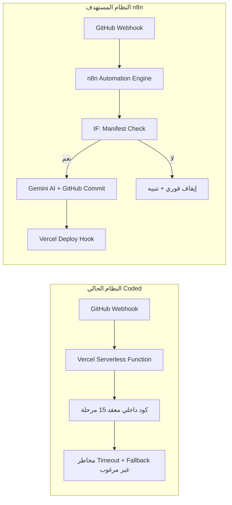
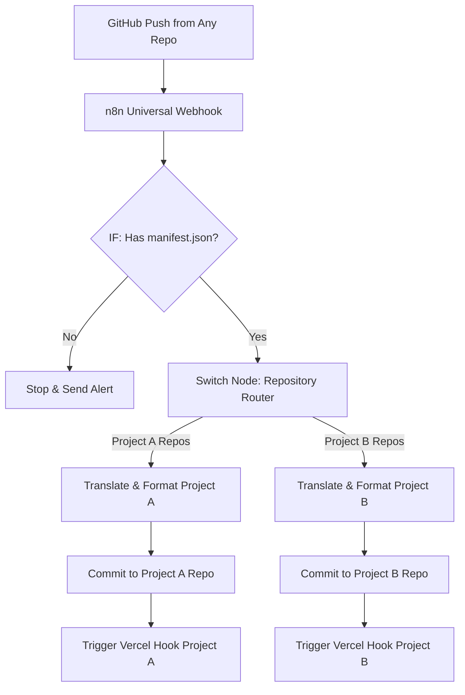
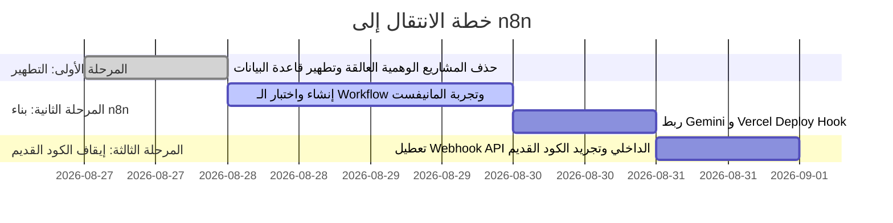

# 📐 دراسة جدوى وتصميم معماري رسمي: تحويل نظام مزامنة المشاريع إلى n8n
## Feasibility Study & Architectural Blueprint: Migrating GitHub Ingestion Pipeline to n8n

**تاريخ الدراسة:** 27 أغسطس 2026  
**الموضوع:** دراسة جدوى استبدال كود المزامنة الداخلي (Coded Pipeline) بمنصة الأتمتة المرئية (n8n Automation Engine)  
**التوافق المستهدف:** Vercel Hosting + GitHub API + Google Gemini AI + Astro SSG/SSR  
**القرار الهندسي الموصى به:** ✅ **موصى به بشدة (Strongly Recommended)**

---

## 1. الملخص التنفيذي (Executive Summary)

تهدف هذه الدراسة إلى تقييم الجدوى الفنية، واستقرار البنية التحتية، وتكلفة التشغيل لنقل نظام سحب وتجهيز مشاريع GitHub من الكود الداخلي إلى منصة **n8n**.

أظهر التحليل الهندسي أن الانتقال إلى n8n سيعالج بشكل جذري التحديات التي واجهها النظام البرمجي الحالي:
1. **القضاء التام على تسريب المشاريع غير المصرح بها (Zero-Leakage Guarantee):** بفضل بوابات الشرط المرئية (`IF Nodes`) التي تقطع مسار التنفيذ فوراً في حال غياب `manifest.json`.
2. **تجاوز قيود Vercel Serverless Timeouts:** إخراج عمليات المعالجة الثقيلة (تحميل الصور، الترجمة بالذكاء الاصطناعي، إنشاء الملفات) من بيئة دوال فيرسيل المحدودة بـ 10-15 ثانية إلى محرك تشغيل خلفي مستقل لا يواجه قيوداً زمنية.
3. **الشفافية الكاملة (Visual Observability & Debugging):** إمكانية رؤية مدخلات ومخرجات كل مرحلة بالبيانات الحية، وإعادة تشغيل أي خطوة فاشلة بضغطة زر دون الحاجة للغوص في ملفات الـ Logs.
4. **تخفيف كود المشروع وتجريده:** حذف مئات الأسطر من الكود المعقد (`PipelineOrchestrator`, `AssetWorker`, `TranslationWorker`, `PublishWorker`)، مما يجعل موقع Astro خفيفاً، وسريع البناء، وسهل الصيانة.

---

## 2. مقارنة معمارية: الكود الداخلي مقابل n8n



| وجه المقارنة | النظام البرمجي الحالي (Coded) | نظام الأتمتة عبر (n8n) |
| :--- | :--- | :--- |
| **التحكم في نشر المشاريع** | يعتمد على محرك Fallback معقد قد يختلق بيانات وينشر دون مانيفست. | تحكم شرطي صارم ومرئي 100% (`IF Node` تمنع المتابعة دون مانيفست). |
| **زمن التنفيذ والقيود** | مقيد بحدود Vercel Serverless (10s إلى 15s) مما يسبب فشل سحب الصور. | غير مقيد بزمن (Unconstrained Background Execution). |
| **المراقبة واكتشاف الأخطاء** | تتبع Logs نصية معقدة عبر Vercel Runtime Logs. | واجهة مرئية بالكامل توضح مدخلات ومخرجات كل خطوة مع الـ Payload. |
| **إعادة المحاولة عند الفشل** | معقدة وتتطلب آليات Idempotency و State Recovery في قاعدة البيانات. | مدمجة في n8n تلقائياً (Auto-Retry + Error Triggers + Re-execute). |
| **حجم كود موقع البورتفوليو** | ضخم (يحتوي على Workers, Queues, Schemas, Translators). | نظيف وخفيف جداً (يقتصر فقط على عرض المحتوى والواجهة). |

---

## 3. التوافق مع فيرسيل (Vercel Integration Blueprint)

> [!NOTE]
> **كيف يتكامل n8n مع Vercel بدون أي تعارض؟**

يعتمد التكامل على آلية **Vercel Deploy Hooks** الرسمية:

1. **الاستقلالية التامة:** يعمل n8n خارج بيئة Vercel (سواء على سيرفر خاص Self-hosted VPS مثل Hetzner/DigitalOcean أو n8n Cloud).
2. **سير العمل المنفصل:**
   - يقوم n8n باستلام الويب هوك ومعالجة البيانات وترجمتها وتحميل الصور.
   - يقوم n8n بإنشاء ملف الماركداون `src/content/projects/ar/[slug].md` وعمل Commit مباشر في ريبو البورتفوليو عبر GitHub API.
3. **إطلاق البناء (Trigger Deployment):**
   - بعد نجاح الـ Commit، يرسل n8n طلب `HTTP POST` إلى **Vercel Deploy Hook URL**.
   - يبدأ Vercel فوراً ببناء ونشر النسخة الجديدة للموقع عبر الـ SSG (Static Site Generation) فائق السرعة.

---

## 4. تشغيل وإدارة مشروعين أو أكثر على نفس النظام (Multi-Project Architecture)

> [!IMPORTANT]
> **هل يمكن إدارة مشروعين بنفس الطريقة؟**  
> **نعم وبكفاءة تامة،** من خلال تطبيق مبدأ **التوجيه الديناميكي الموحد (Dynamic Router Pattern)** داخل n8n.



### معايير ضبط المشروعين:
1. **عقدة التوجيه (Switch Node):** تفحص حقل `{{ $json.body.repository.name }}` لتحديد الوجهة والمستودع المناسب.
2. **عزل خطافات النشر (Deploy Hooks Isolation):** لكل موقع Hook مستقل في Vercel، لضمان عدم إعادة بناء الموقع الآخر عند تحديث مشروع لا يخصه.
3. **إعدادات ومفاتيح مخصصة:** يمكن تخصيص Prompts ترجمة مختلفة لـ Gemini لكل مشروع حسب تخصصه (مثلاً: مشاريع Data Analytics مقابل مشاريع Web Development).

---

## 5. المخطط الهندسي التفصيلي لسير العمل (Node-by-Node Specification)

```
[1. GitHub Trigger]
       │
       ▼
[2. GitHub API: Get manifest.json]
       │
       ▼
[3. IF: manifest exists & status == 200?]
      ├─── [FALSE] ──► [Log Rejection] ──► [Telegram Alert: Skipped Repo] ──► [Stop]
      │
      └─── [TRUE]
             │
             ▼
      [4. Base64 Decode & Validate Manifest]
             │
             ▼
      [5. Google Gemini AI: Translate Metadata (EN -> AR)]
             │
             ▼
      [6. Asset Processor: Optimize & Map Image URLs]
             │
             ▼
      [7. Code Node: Generate Markdown Frontmatter]
             │
             ▼
      [8. GitHub API: Commit AR/EN Markdown Files]
             │
             ▼
      [9. HTTP Request: Trigger Vercel Deploy Hook]
             │
             ▼
      [10. Telegram Alert: Success Notification]
```

### توصيف العقد الرئيسية (Key Nodes Configuration):

1. **`GitHub Trigger Node`:**
   - **الحدث:** `push`
   - **التحقق:** HMAC Signature Secret.
2. **`Manifest Gatekeeper (IF Node)`:**
   - **الشرط الصارم:** `{{ $json.status == 200 && $json.data.content != undefined }}`.
   - **المسار السلبي:** إيقاف فوري وتسجيل التخطي، مع إرسال إشعار للمطور.
3. **`Google Gemini Node`:**
   - **المهمة:** صياغة وترجمة حقول `problem`, `solution`, `businessValue` بدقة لغوية مصقولة دون المساس بالمصطلحات التقنية.
4. **`Markdown Generator (Code Node)`:**
   - **المهمة:** تجميع الـ YAML Frontmatter المطابق تماماً لـ Astro Content Schema (`src/content/config.ts`).
5. **`Vercel Deploy Trigger (HTTP Request Node)`:**
   - **النوع:** `POST`
   - **الرابط:** `https://api.vercel.com/v1/integrations/deploy/prj_...`

---

## 6. خطة الانتقال والتنفيذ (Migration Roadmap)



---

## 7. التوصية والقرار النهائي (Final Recommendation)

> [!TIP]
> **التوصية:**
> 1. **الاعتماد:** المضي قدماً في تطبيق معمارية **n8n** كنظام مزامنة خارجي متكامل للمشاريع.
> 2. **الإجراء الفوري المطلوب الآن:** تطهير ملفات الماركداون الحالية العالقة في الموقع (`amr-mousa0.md`) وتنظيف السجلات الشبحية من قاعدة البيانات حتى يصبح الموقع نظيفاً وجاهزاً لاستقبال المشاريع الحقيقية فقط.
