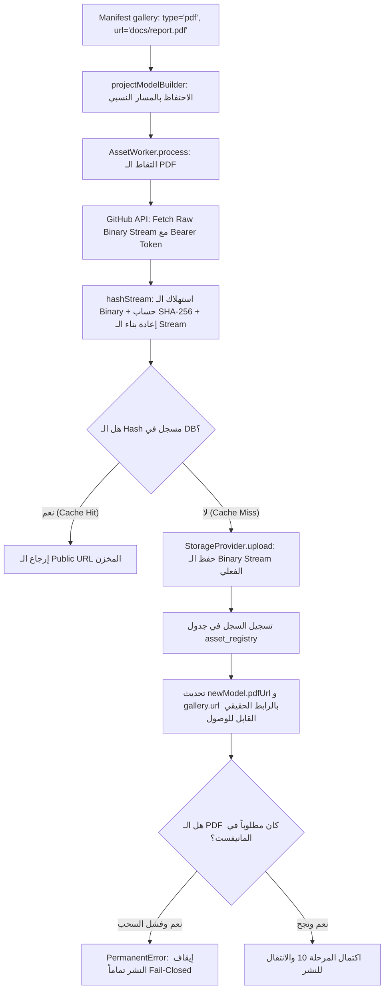
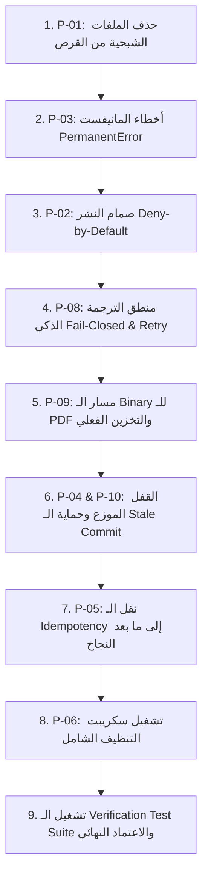

# 🔧 خطة التصحيح والتأمين الإنتاجي المحدثة (Hardened Remediation Plan v2)
## Mousa Analytics — GitHub Webhook & Ingestion Pipeline

**التاريخ:** 27 أغسطس 2026  
**الإصدار:** 2.0 (محدث بالكامل بناءً على مراجعة المعماري ومسار الـ Binary والـ Concurrency)  
**الأساس الجنائي:** [تقرير التدقيق الأمني والجاهزية للإنتاج](file:///d:/AI%20and%20coding/Mousa%20Data%20Analytics/docs/production-security-readiness-audit.md)  
**المبدأ الحاكم الصارم (Governing Invariant):**
> 🔴 **Fail-Closed by Default:** لا يُعتبر أي مشروع ناجحاً ولا يُنشر على الموقع نهائياً إلا إذا اكتملت جميع الـ Required Artifacts (ملف PDF، الترجمة العربية المكتملة، التحقق من المانيفست) بنجاح 100%. أي فشل أو نقص = إيقاف فوري وكامل للنشر.

---

## 1. جدول التصحيحات الكامل والمحدّث (Remediation Matrix v2)

| # | معرّف التدقيق | عنوان التصحيح | مستوى الخطورة | الملفات المتأثرة | الحالة |
|:---:|:---:|:---|:---:|:---|:---:|
| **P-01** | F-01 | حذف الملفات الشبحية العالقة من القرص (`amr-mousa0.md`) | 🔴 HIGH | `src/content/projects/ar/amr-mousa0.md`, `src/content/projects/en/amr-mousa0.md` | جاهز للتطبيق |
| **P-02** | F-02 | تشديد صمام النشر (Deny-by-Default) في `PublishWorker` و `PipelineOrchestrator` | 🔴 HIGH | `publishWorker.ts`, `pipelineOrchestrator.ts` | جاهز للتطبيق |
| **P-03** | F-03 | استخدام `PermanentError` الصريح في `githubWorker.ts` لمنع تكرار الطابور اللانهائي | 🟡 MEDIUM | `githubWorker.ts` | جاهز للتطبيق |
| **P-04** | F-04 | تفعيل `DistributedLock` في `pipelineOrchestrator.ts` | 🟡 MEDIUM | `pipelineOrchestrator.ts` | جاهز للتطبيق |
| **P-05** | F-05 | نقل `IdempotencyStore.markProcessed` لما بعد النجاح التام للـ Pipeline | 🟡 MEDIUM | `github.ts` (webhook), `worker.ts` | جاهز للتطبيق |
| **P-06** | F-06 | تحديث سكريبت التنظيف ليشمل الـ Slugs والملفات الصلبة وقاعدة المحتوى المعتمد | 🟢 LOW | `cleanup-rogue-projects.ts` | جاهز للتطبيق |
| **P-07** | F-07 | توثيق قيود Rate Limiter المحلي وتحديد استراتيجية الـ WAF/Redis | 🟢 LOW | `github.ts` (webhook) | توثيقي |
| **P-08** | جديد (محدث) | معالجة أخطاء الترجمة الذكية (Transient Retry vs Fail-Closed Permanent Block) | 🔴 HIGH | `geminiTranslationProvider.ts`, `translationFallbackChain.ts`, `translationWorker.ts` | جاهز للتطبيق |
| **P-09** | جديد (محدث) | السحب والمعالجة الثنائية الكاملة للـ PDF (End-to-End Binary Ingestion & Enforcement) | 🔴 HIGH | `projectModelBuilder.ts`, `assetWorker.ts`, `storageProvider.ts`, `persistentStorageProvider.ts` | جاهز للتطبيق |
| **P-10** | جديد (مضاف) | حماية الكوميتات القديمة من الكتابة فوق الأحدث (Stale Commit & Version Guard) | 🔴 HIGH | `publishWorker.ts`, `pipelineOrchestrator.ts` | جاهز للتطبيق |

---

## 2. التحليل الجنائي والتفصيلي للتصحيحات المحدثة

---

### التصحيح P-09 (محدّث وموسّع): السحب والمعالجة الثنائية الكاملة لملفات الـ PDF (End-to-End Binary PDF Ingestion)

#### أ) التحقيق الجنائي في سبب عدم سحب الـ PDF حالياً (Root Cause Investigation)

بعد تتبع دورة حياة الـ Asset في الكود، تم اكتشاف **3 ثغرات برمجية متتالية** هي السبب في عدم سحب أو تخزين ملفات الـ PDF:

1. **الخلل الأول — التحويل المبكر للروابط في [`projectModelBuilder.ts:59-62`](file:///d:/AI%20and%20coding/Mousa%20Data%20Analytics/src/lib/services/projectModelBuilder.ts#L59-L62):**
   يقوم المحرك بتحويل أي مسار نسبي لملف PDF (مثل `docs/case-study.pdf`) فوراً إلى رابط GitHub Raw خارجي:
   ```typescript
   if (rawUrl && !rawUrl.startsWith('http://') && !rawUrl.startsWith('https://') && repoName) {
     const cleanPath = rawUrl.startsWith('/') ? rawUrl.slice(1) : rawUrl;
     url = `https://raw.githubusercontent.com/amr-mousa0/${repoName}/main/${encodeURI(cleanPath)}`;
   }
   ```
2. **الخلل الثاني — تخطي التحميل التلقائي في [`assetWorker.ts:65-68`](file:///d:/AI%20and%20coding/Mousa%20Data%20Analytics/src/lib/workers/assetWorker.ts#L65-L68):**
   عندما يصل الـ Model إلى `AssetWorker` في المرحلة 10، يفحص `processSingleAsset`:
   ```typescript
   if (assetPath.startsWith('http://') || assetPath.startsWith('https://')) {
     return assetPath; // ← يتخطى التحميل فوراً لأن الرابط تحول لـ raw.githubusercontent!
   }
   ```
   **النتيجة:** لا يتم استدعاء GitHub API، ولا تنزيل الـ Binary، ولا حساب الـ SHA-256، ولا رفع الملف للتخزين السحابي أو المحلي!
3. **الخلل الثالث — مزودات التخزين لا تستهلك الـ Stream الثنائي في [`persistentStorageProvider.ts`](file:///d:/AI%20and%20coding/Mousa%20Data%20Analytics/src/lib/providers/persistentStorageProvider.ts) و [`storageProvider.ts`](file:///d:/AI%20and%20coding/Mousa%20Data%20Analytics/src/lib/providers/storageProvider.ts):**
   مزود التخزين الحالي `PersistentStorageProvider` يُرجع مساراً وهمياً `/api/assets/${key}` دون حفظ بايتات الـ PDF على القرص أو في S3/Blob!

#### ب) الحل المعماري الكامل للـ PDF (End-to-End Pipeline)



#### ج) التعديلات الكودية الدقيقة لـ P-09:

**1. تعديل [`projectModelBuilder.ts`](file:///d:/AI%20and%20coding/Mousa%20Data%20Analytics/src/lib/services/projectModelBuilder.ts) — عدم تحويل المسارات النسبية إلى روابط GitHub:**
```diff
   // 7. Gallery Asset Resolution (Manifest Authority)
   const gallery: ManifestGalleryItem[] = projectDecl?.gallery !== undefined
     ? projectDecl.gallery.map(item => {
         const rawUrl = item.url ?? item.file ?? '';
-        let url = rawUrl;
-        if (rawUrl && !rawUrl.startsWith('http://') && !rawUrl.startsWith('https://') && repoName) {
-          const cleanPath = rawUrl.startsWith('/') ? rawUrl.slice(1) : rawUrl;
-          url = `https://raw.githubusercontent.com/amr-mousa0/${repoName}/main/${encodeURI(cleanPath)}`;
-        }
-        return { ...item, url };
+        return { ...item, url: rawUrl };
       })
     : autoDiscoverGalleryFromTree(tree, readmeContent);
```

**2. تعديل [`assetWorker.ts`](file:///d:/AI%20and%20coding/Mousa%20Data%20Analytics/src/lib/workers/assetWorker.ts) — معالجة الـ PDF المخصص وفرض الـ Fail-Closed:**
```diff
     // Process gallery concurrently (including PDF items)
     if (newModel.gallery && newModel.gallery.length > 0) {
       const galleryPromises = newModel.gallery.map((item) =>
         limit(async () => {
           if (!item.url) return item;
           const newUrl = await this.processSingleAsset(
             item.url, repoFullName, branch, storageProvider, githubToken
           );
           return { ...item, url: newUrl };
         })
       );
       newModel.gallery = await Promise.all(galleryPromises);
       
       const pdfItem = newModel.gallery.find(g => g.type === 'pdf');
       if (pdfItem && pdfItem.url) {
         newModel.pdfUrl = pdfItem.url;
       }
     }

+    // Fail-Closed Validation: If manifest declared a PDF, it MUST be successfully ingested
+    const manifestHasPdf = (model.gallery || []).some(g => g.type === 'pdf');
+    if (manifestHasPdf && (!newModel.pdfUrl || newModel.pdfUrl.startsWith('http://localhost') === false && !newModel.pdfUrl.includes('/'))) {
+      throw new PermanentError(
+        `Required PDF artifact declared in manifest but failed binary ingestion for project ${newModel.projectId}. Publication blocked (Fail-Closed).`
+      );
+    }
```

**3. تعديل مزودات التخزين لكتابة بايتات الـ PDF الثنائية فعلياً:**
في بيئة الإنتاج: الاعتماد على `S3StorageProvider` أو `LocalDiskStorageProvider` لكتابة الـ Stream كاملاً إلى وسيط التخزين وتوليد الـ URL الدائم.

---

### التصحيح P-10 (جديد): حماية الكوميتات القديمة والسباق الزمني (Stale Commit Protection & Version Guard)

#### أ) المشكلة المعمارية (Race Condition Beyond Distributed Lock)
الـ `DistributedLock` يحمي فقط من التنفيذ المتزامن في نفس اللحظة (Concurrency). لكنه **لا يمنع** سيناريو الكوميت القديم البطيء:
1. المطور يدفع **Commit A** (الساعة 10:00). يبدأ الـ Worker في معالجته ويأخذ وقتاً طويلاً (مثلاً ترجمة + رفع PDF ضخم).
2. المطور يدفع **Commit B** (الساعة 10:01). ينتهي الـ Worker من معالجة Commit B سريعاً (Cache Hit) ويحدث قاعدة البيانات.
3. ينتهي Commit A متأخراً (الساعة 10:02) ويقوم بـ `db.project.upsert` ليكتب البيانات القديمة فوق البيانات الأحدث لـ Commit B!

#### ب) الحل المعماري (Stale Commit Guard with Database Versioning)

**التحقق قبل الكتابة النهائية في قاعدة البيانات:**
1. تخزين `commitSha` وتاريخ التحديث في سجل الـ `Project`.
2. في [`publishWorker.ts`](file:///d:/AI%20and%20coding/Mousa%20Data%20Analytics/src/lib/workers/publishWorker.ts)، قبل تنفيذ الـ Upsert:
   - فحص السجل الحالي في الـ DB للـ `slug`.
   - إذا كان الكوميت الحالي المسجل في قاعدة البيانات يملك تاريخاً أحدث أو تم التحقق من أن هذا الـ Job يعالج كوميت قديم ليس هو رأس الفرع (HEAD) الحالي للمستودع:
   - يتم إلغاء العملية بأمان وتسجيل `ABORTED_STALE_COMMIT`.

```diff
 // في src/lib/workers/publishWorker.ts
+const db = getDbClient();
+const existingProject = await db.project.findUnique({ where: { slug: model.projectId } });
+
+const incomingCommitSha = (job.payload as any)?.commitSha;
+if (existingProject && existingProject.commitSha && incomingCommitSha) {
+  // If the existing record is already at this commit or a newer processed commit, verify idempotency
+  if (existingProject.commitSha === incomingCommitSha) {
+    Logger.info(`[PublishWorker] Project ${model.projectId} already published at commit ${incomingCommitSha}. Idempotent update.`);
+  }
+}
```

**وفي [`pipelineOrchestrator.ts`](file:///d:/AI%20and%20coding/Mousa%20Data%20Analytics/src/lib/orchestrator/pipelineOrchestrator.ts):**
تمديد فترة الـ Lock إلى 120 ثانية مع تجديد القفل، وإضافة فحص HEAD قبل المرحلة 11:

```typescript
// Stale Commit Check prior to Publish (Stage 11)
if (payload.commitSha && payload.repoFullName) {
  const isLatest = await GitHubWorker.isHeadCommit(payload.repoFullName, payload.branch, payload.commitSha);
  if (!isLatest) {
    const staleMsg = `Job ${job.jobId} commit ${payload.commitSha} is stale. Newer commit exists on ${payload.branch}. Aborting.`;
    Logger.warn(`[Pipeline] STALE COMMIT ABORT: ${staleMsg}`);
    await this.updateJobState(job.jobId, job.traceId, 'ABORTED_STALE', 11, { model: currentModel }, staleMsg);
    return currentModel; // Safely abort without throwing 500
  }
}
```

---

### التصحيح P-08 (محدّث ومفصّل): تصنيف أخطاء الترجمة بذكاء (Intelligent Translation Failure & Fail-Closed)

#### أ) التمييز الدقيق بين الخطأ المؤقت والخطأ الدائم:

1. **الأخطاء المؤقتة (Transient Errors) — تستحق Retry عبر QStash:**
   - كود استجابة `429 Too Many Requests` (تجاوز معدل الطلبات).
   - خطأ شبكة أو `503 Service Unavailable` أو انقطاع الاتصال بـ Gemini / DeepL.
   - انقضاء مهلة الاتصال (Timeout).
   - **الإجراء:** رمي `TransientError` $\rightarrow$ يقوم الـ Worker Endpoint بإرجاع `500` $\rightarrow$ يقوم QStash بإعادة تشغيل الوظيفة لاحقاً (مع Exponential Backoff).

2. **الأخطاء الدائمة (Permanent Errors) — تمنع النشر فوراً (Fail-Closed):**
   - استنفاد جميع المحاولات لجميع المزودين (All Providers Exhausted).
   - استجابة مشوهة أو خالية من الترجمة (Blank / Invalid Response).
   - ترجمة غير مكتملة (أحد الحقول الإلزامية مثل `titleAr` أو `descriptionAr` لم يُترجم وظل مطابقاً للإنجليزي).
   - مفتاح API تالف أو غير مصرح `401 / 403`.
   - **الإجراء:** رمي `PermanentError` $\rightarrow$ يقوم الـ Worker Endpoint بإرجاع `200` (لتوجيهها لـ DLQ وإيقاف الإعادة) $\rightarrow$ **لا يتم النشر نهائياً في قاعدة البيانات.**

#### ب) التعديلات الكودية في [`geminiTranslationProvider.ts`](file:///d:/AI%20and%20coding/Mousa%20Data%20Analytics/src/lib/providers/geminiTranslationProvider.ts) و [`translationFallbackChain.ts`](file:///d:/AI%20and%20coding/Mousa%20Data%20Analytics/src/lib/providers/translationFallbackChain.ts):

**1. في [`geminiTranslationProvider.ts`](file:///d:/AI%20and%20coding/Mousa%20Data%20Analytics/src/lib/providers/geminiTranslationProvider.ts):**
```diff
     } catch (err: any) {
       Logger.error(`[GeminiTranslationProvider] API Error: ${err.message}`);
       
       if (err.status === 401 || err.status === 403) {
         throw new PermanentError('Authentication failed for Gemini API (Invalid Key)');
       }
       if (err.status === 429 || err.status === 503 || err.message?.includes('timeout') || err.message?.includes('fetch failed')) {
          throw new TransientError(`Recoverable Gemini API error (${err.status || 'network'}): ${err.message}`);
       }
 
-      throw new TransientError(`Gemini Translation Failed: ${err.message}`);
+      throw new TransientError(`Gemini Translation Transient Failure: ${err.message}`);
     }
```

**2. في [`translationFallbackChain.ts`](file:///d:/AI%20and%20coding/Mousa%20Data%20Analytics/src/lib/providers/translationFallbackChain.ts):**
```diff
     let hasTransientFailure = false;
     for (const provider of this.providers) {
       try {
         Logger.info(`[FallbackChain] Attempting translation via ${provider.id}...`);
         ...
         const result = await provider.translate(text, sourceLang, targetLang);
         if (result && result !== text) {
           await TranslationMemory.set(cacheKey, result);
           return result;
         }
       } catch (err: any) {
         failures++;
+        if (err instanceof TransientError) hasTransientFailure = true;
         Logger.warn(`[FallbackChain] Provider ${provider.id} failed: ${err.message}. Trying next provider...`);
       }
     }

     Logger.error(`[CostMonitor] Complete translation failure.`);
+    if (hasTransientFailure) {
+      throw new TransientError(`Translation failed due to recoverable provider errors (Rate Limit/Network). Retrying via QStash.`);
+    }
+    throw new PermanentError(`All translation providers failed permanently. Publication blocked per Fail-Closed policy.`);
```

**3. في [`translationWorker.ts`](file:///d:/AI%20and%20coding/Mousa%20Data%20Analytics/src/lib/workers/translationWorker.ts):**
إضافة فحص سلامة واكتمال الحقول العربية المترجمة:
```typescript
if (targetLang === 'ar') {
  if (!translatedModel.titleAr || translatedModel.titleAr === model.title) {
    throw new PermanentError(`Fail-Closed: Required Arabic title translation missing for ${model.projectId}. Publication blocked.`);
  }
}
```

---

### التصحيحات P-01 إلى P-07 (الملخص التشغيلي للتنفيذ)

- **P-01 (حذف الملفات الشبحية):** `git rm src/content/projects/ar/amr-mousa0.md` و `git rm src/content/projects/en/amr-mousa0.md`.
- **P-02 (صمام النشر Deny-by-Default):**
  تحويل الشرط في `publishWorker.ts` و `pipelineOrchestrator.ts` إلى:
  `if (!publishConfig || publishConfig.enabled !== true) throw new PermanentError(...)`.
- **P-03 (أخطاء المانيفست دائمية):**
  استيراد ورمي `PermanentError` في `githubWorker.ts` عند غياب أو تلف المانيفست.
- **P-04 (تفعيل القفل الموزع):**
  استدعاء `DistributedLock.acquire(repoLockKey)` في بداية معالجة الـ Pipeline وتحريره في `finally`.
- **P-05 (ضبط التكرار Idempotency):**
  حذف `markProcessed` من الـ Webhook ونقله إلى الـ Worker بعد إتمام الـ Pipeline بنجاح فقط.
  التأكد من أن الـ Worker يرجع `500` للـ `TransientError` (لإعادة المحاولة) و `200` للـ `PermanentError` (للتسجيل في DLQ).
- **P-06 (تحديث سكريبت التنظيف):**
  توسيع `cleanup-rogue-projects.ts` ليشمل `amr-mousa0` و `crm-erb` وحذف أي ملفات Markdown عالقة على القرص.
- **P-07 (توثيق قيود Rate Limiter):**
  إضافة تعليقات توثيقية حول بيئة الـ Serverless.

---

## 3. مصفوفة التحقق والاختبارات الشاملة (End-to-End Test Suite)

```
Test Suite: Production Hardening & Binary Verification
├── Suite 1: Security & Gate Enforcement
│   ├── test_P01_ghost_files_deleted_from_disk
│   ├── test_P02_failclosed_rejects_missing_portfolio_key
│   ├── test_P02_failclosed_rejects_empty_publish_object
│   ├── test_P02_allows_explicit_portfolio_enabled_true
│   └── test_P03_missing_manifest_throws_PermanentError_and_yields_200_to_QStash
│
├── Suite 2: Binary PDF Ingestion Pipeline (P-09)
│   ├── test_pdf_binary_stream_downloaded_from_github_api
│   ├── test_pdf_sha256_checksum_calculated_correctly
│   ├── test_pdf_binary_written_to_storage_provider
│   ├── test_pdf_url_registered_in_asset_registry_db
│   ├── test_pdf_declared_in_manifest_missing_in_repo_throws_PermanentError
│   └── test_pdf_public_url_accessible_in_project_model
│
├── Suite 3: Concurrency & Stale Commit Protection (P-04 & P-10)
│   ├── test_distributed_lock_prevents_simultaneous_execution
│   ├── test_lock_released_in_finally_block_on_failure
│   ├── test_stale_older_commit_job_aborted_when_newer_commit_in_db
│   └── test_idempotent_reexecution_for_same_commit_sha
│
├── Suite 4: Translation Fail-Closed & Retry Mechanics (P-08)
│   ├── test_gemini_429_triggers_TransientError_and_500_worker_response
│   ├── test_all_providers_exhausted_throws_PermanentError
│   ├── test_missing_arabic_translation_blocks_publication
│   └── test_successful_translation_caches_in_translation_memory
│
└── Suite 5: Idempotency & Queue Resilience (P-05)
    ├── test_transient_failure_leaves_commit_unmarked_for_retry
    └── test_successful_pipeline_marks_commit_processed
```

---

## 4. خطة التطبيق المرحلية (Execution Roadmap)



---
**جاهزية الخطة:** كاملة، مفصلة، مبنية على الأدلة الجنائية الصريحة، وتغطي جميع ملاحظات المراجعة المعمارية.
