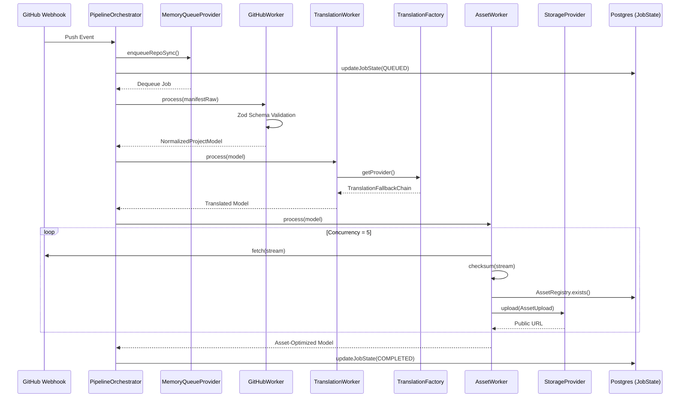

# Runtime Architecture Documentation

## Core Orchestration Pipeline

The Pipeline Orchestrator executes a 15-stage state machine that ingests a GitHub Repository and yields a localized, asset-optimized, published Project inside the Portfolio.

### System Flow

## Resilience and Fallbacks

1. **State Persistence:** Every stage transition persists the complete payload and model into the `job_states` Postgres table. If the Node process crashes, a restart can resume directly from the last successful stage.
2. **Translation Memory:** API cost control is enforced by a Vercel KV Redis layer wrapping the Translation Providers.
3. **Storage Abstraction:** The system routes uploads to Local Disk (development), Vercel Blob, or S3 seamlessly.
4. **Asset Integrity:** Downloaded assets are hashed on-the-fly. Database checks against the `AssetRegistry` prevent redundant cloud uploads, saving massive bandwidth on large files.
