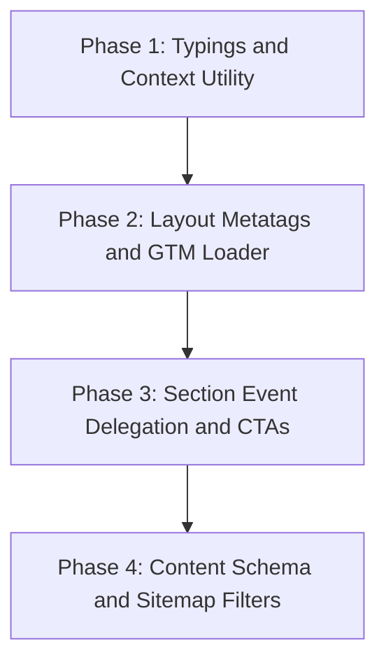

# Implementation Plan: Analytics, Tracking, and SEO Growth (Revised Pass)

**Branch**: `007-analytics-seo-roadmap` | **Date**: 2026-05-25 | **Spec**: [spec.md](file:///c:/Users/HP/Downloads/new%20portofolio/specs/007-analytics-seo-roadmap/spec.md)

---

## 1. Centralized Page Context Helper

We will implement a simplified `src/scripts/pageContext.ts` that reads page context variables injected into a server-rendered `<script id="page-metadata" type="application/json">` script tag in the page layout. This eliminates fragile URL pathname inspection or custom DOM scraping.

#### [NEW] [pageContext.ts](file:///c:/Users/HP/Downloads/new%20portofolio/src/scripts/pageContext.ts)
```typescript
export interface PageContext {
  locale: 'en' | 'ar';
  pathname: string;
  slug: string;
  contentType: 'service' | 'project' | 'blog' | 'page';
  pageCategory: string;
  environment: 'development' | 'staging' | 'production';
  isFallback: boolean;
}

export const getPageContext = (): PageContext => {
  if (typeof window === 'undefined') {
    return {
      locale: 'en',
      pathname: '',
      slug: '',
      contentType: 'page',
      pageCategory: 'general',
      environment: 'production',
      isFallback: false
    };
  }

  const metaEl = document.getElementById('page-metadata');
  if (metaEl && metaEl.textContent) {
    try {
      const parsed = JSON.parse(metaEl.textContent);
      return {
        locale: parsed.locale || 'en',
        pathname: window.location.pathname,
        slug: parsed.slug || 'home',
        contentType: parsed.contentType || 'page',
        pageCategory: parsed.pageCategory || 'general',
        environment: parsed.environment || 'production',
        isFallback: !!parsed.isFallback
      };
    } catch (e) {
      console.error('[PageContext] Error parsing script JSON metadata', e);
    }
  }

  return {
    locale: window.location.pathname.startsWith('/ar') ? 'ar' : 'en',
    pathname: window.location.pathname,
    slug: 'home',
    contentType: 'page',
    pageCategory: 'general',
    environment: 'production',
    isFallback: false
  };
};
```

---

## 2. Centralized Analytics Utility

We will implement the strictly typed `src/scripts/analytics.ts` that enforces discriminated union event payloads.

#### [NEW] [analytics.ts](file:///c:/Users/HP/Downloads/new%20portofolio/src/scripts/analytics.ts)
```typescript
import { getPageContext } from './pageContext';

export interface EnrichedParams {
  language: 'en' | 'ar';
  page_path: string;
  analytics_env: 'development' | 'staging' | 'production';
  timestamp: string;
}

export type TrackedEventPayload =
  | { event: 'project_view'; slug: string; title: string; category: string }
  | { event: 'service_view'; slug: string; title: string; category: string }
  | { event: 'language_switch'; source_lang: 'en' | 'ar'; target_lang: 'en' | 'ar' }
  | { event: 'cta_click'; cta_text: string; cta_type: 'whatsapp' | 'email' | 'call' | 'form'; context_slug?: string }
  | { event: 'contact_form_submit'; form_id: string };

export type AnalyticsEvent = TrackedEventPayload & EnrichedParams;

export const trackEvent = (payload: TrackedEventPayload) => {
  const context = getPageContext();

  // Traffic Isolation: Disable analytics tracking on development unless explicit debug query is active
  if (context.environment === 'development' && !window.location.search.includes('gtm_debug=true')) {
    return;
  }

  if (typeof window === 'undefined') return;

  // Initialize dataLayer safely
  window.dataLayer = window.dataLayer || [];

  // Enrich payload with default page-level variables
  const fullPayload: AnalyticsEvent = {
    ...payload,
    language: context.locale,
    page_path: context.pathname,
    analytics_env: context.environment,
    timestamp: new Date().toISOString()
  };

  window.dataLayer.push(fullPayload);
};
```

---

## 3. GTM Script Loading & Astro Metatags

### Standard Asynchronous Loading
We will load GTM asynchronously using Google's recommended script tag structure in the head, keeping the code clean, debuggable, and easy to maintain.

#### [MODIFY] [Layout.astro](file:///c:/Users/HP/Downloads/new%20portofolio/src/layouts/Layout.astro)
- Add props: `contentType`, `slug`, `pageCategory`, `isFallback`.
- Server-render the `<script id="page-metadata" type="application/json">` block (resolving build-time variables):
  ```astro
  ---
  const environment = import.meta.env.DEV 
    ? 'development' 
    : (process.env.CONTEXT === 'deploy-preview' || process.env.CONTEXT === 'branch-deploy' ? 'staging' : 'production');

  const pageContext = {
    locale: lang,
    slug: slug || pageId,
    contentType: contentType || 'page',
    pageCategory: pageCategory || 'general',
    environment,
    isFallback: !!isFallback
  };
  ---
  <script id="page-metadata" type="application/json" is:inline set:html={JSON.stringify(pageContext).replace(/</g, '\\u003c')} />
  ```
- Conditional server-rendering of robots indexing directives in layout head:
  ```astro
  {showNoindex && <meta name="robots" content="noindex, follow" />}
  ```
- Inject standard GTM script loader in `<head>`:
  ```html
  <!-- Google Tag Manager -->
  <script is:inline>
    (function(w,d,s,l,i){w[l]=w[l]||[];w[l].push({'gtm.start':
    new Date().getTime(),event:'gtm.js'});var f=d.getElementsByTagName(s)[0],
    j=d.createElement(s),dl=l!='dataLayer'?'&l='+l:'';j.async=true;j.src=
    'https://www.googletagmanager.com/gtm.js?id='+i+dl;f.parentNode.insertBefore(j,f);
    })(window,document,'script','dataLayer','GTM-XXXXXX');
  </script>
  <!-- End Google Tag Manager -->
  ```
- Inject standard GTM noscript iframe at the top of `<body>`:
  ```html
  <!-- Google Tag Manager (noscript) -->
  <noscript><iframe src="https://www.googletagmanager.com/ns.html?id=GTM-XXXXXX"
  height="0" width="0" style="display:none;visibility:hidden"></iframe></noscript>
  <!-- End Google Tag Manager (noscript) -->
  ```

### 3.1 Pageview and Environment Decisions

#### Pageview Strategy
- **Standard Automatic Pageviews**: We rely completely on GA4 Enhanced Measurement's automatic `page_view` trigger.
- **No Virtual Pageviews**: To avoid duplicate pageview logging, we do not push custom virtual pageviews on initial load. Since this is a standard Multi-Page Application (MPA) and does not currently use active SPA View Transitions, every route transition is a full page load that triggers GA4 automatically.
- **Custom View Telemetry**: Custom events `project_view` and `service_view` are fired as separate, distinct engagement events to record rich parameters (`slug`, `title`, `category`, `is_fallback`), rather than overriding standard pageviews.

#### Environment Isolation Strategy
- **Single GTM Container**: We load a single Google Tag Manager container across all environments.
- **Dynamic Variable Routing**: GTM will inspect the `analytics_env` parameter pushed via our tracking library.
- **Lookup Table Mapping**: Inside GTM, a Lookup Table maps `analytics_env` values:
  - `production` -> Route to Production GA4 Property (`G-XXXXXX`)
  - `staging` -> Route to Staging GA4 Property (`G-YYYYYY`)
  - `development` -> Do not trigger any GA4 tag (or log to GTM Preview console only)
- This isolates staging/preview traffic from contaminating production analytics data without the overhead of maintaining separate container scripts.

---

## 4. Implementation Phases



### Phase 1: Typings and Context Utility
- Create global types `src/types/analytics.d.ts`.
- Create `src/scripts/pageContext.ts` parsing JSON script content.
- Create `src/scripts/analytics.ts` implementing `trackEvent` wrapper.

### Phase 2: Layout Metatags and GTM Loader
- Modify `Layout.astro` to receive page props, output page-metadata JSON script block, and render GTM script tags.
- Implement static server-rendered fallback `noindex` and strict trailing slashes.

### Phase 3: Section Event Delegation and CTAs
- Register contact form submit hook via `lifecycle.addListener` in `Contact.astro`.
- Bind global click delegator on CTA elements (WhatsApp, call, social links) inside section scripts.

### Phase 4: Content Schema and Sitemap Filters
- Update `src/content/config.ts` defining the Zod schemas for blog collections.
- Update sitemap configuration filter inside `astro.config.mjs`.
